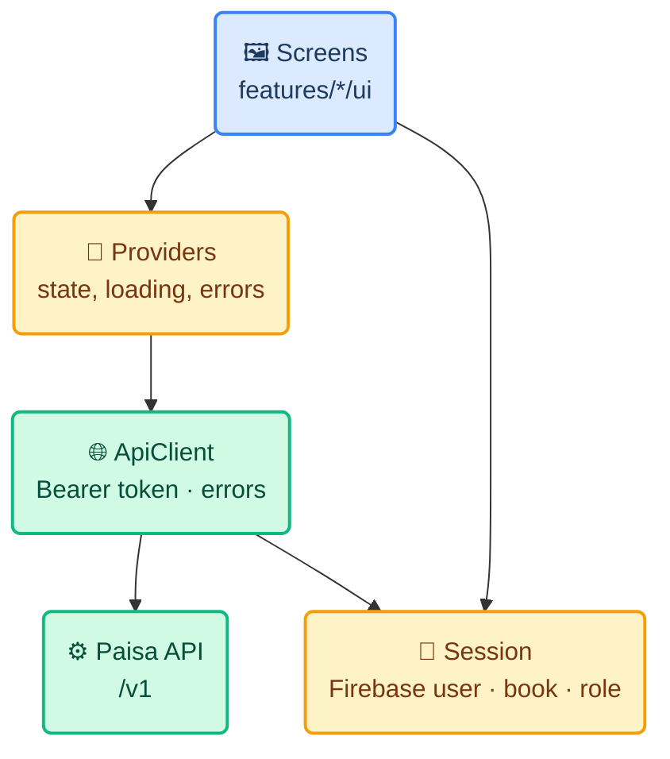
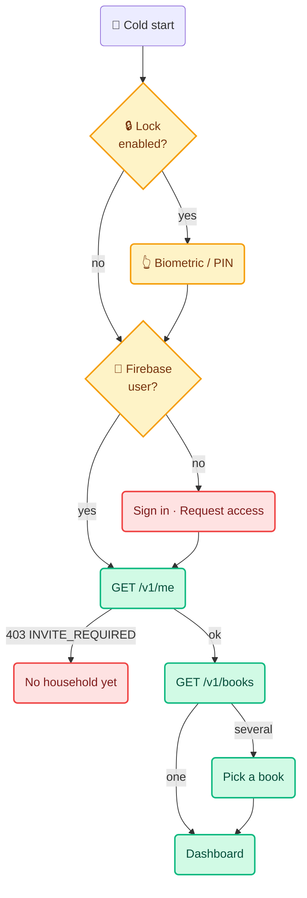

# 02 · Technical Design

> **Last reviewed** 2026-10-05 · Everything below was read from the code in
> `apps/api` on this date. Where a response shape has **not** been observed it is
> marked *(capture in Phase 0)* rather than guessed.

## 1. Stack

| Layer | Choice | Why |
|---|---|---|
| Language / UI | Dart 3.10 + Flutter 3.38 | Installed here; Android now, iOS later from one codebase |
| State | `flutter_riverpod` | Month, selected book and role are shared by most screens; one dependency covers state, async loading and caching |
| Navigation | Plain `Navigator` + an auth gate widget | Five tabs and a few pushed screens. Move to `go_router` only when invitation deep links arrive |
| HTTP | `http` (already used in the old app) | Eleven kinds of call, no interceptors needed beyond one wrapper |
| Auth / push / crash | `firebase_core` + `firebase_auth` (Phase 0), `firebase_messaging` (Phase 7), `firebase_crashlytics` (Phase 8, with its Gradle plugin) | Same Firebase project as the web |
| App lock | `local_auth` | Biometric or device PIN |
| Secure storage | `flutter_secure_storage` *(only if something sensitive ever needs storing)* | None planned for v1: Firebase holds the session and the app keeps no token |
| Preferences | `shared_preferences` | Theme mode, last book, last tab. None of it sensitive |
| File picking | `file_picker` | Statement import |
| Hashing | `crypto` | SHA-256 of the import file (the API requires it) |
| Formatting | `intl` | `en_IN` digit grouping |
| Fonts | System serif for headings, system sans for the rest | No runtime font fetch and no Google call from a finance app. Bundling Geist (needs `.ttf`; the web ships `.woff2`) is an optional later polish |

**Deliberately left out:** code generation (`freezed`, `json_serializable`,
`build_runner`) because the models are small and hand-written ones fail loudly
and need no build step; `dio`; `google_fonts`; a local database (no offline cache
in v1); a DI framework beyond Riverpod.

## 2. Folder layout

```text
Mobile App/
├── README.md  01-requirements.md  02-technical-design.md  03-development-plan.md
└── app/                         Flutter project, Android-only at first
    ├── pubspec.yaml
    ├── lib/
    │   ├── main.dart            Firebase init, ProviderScope, MaterialApp
    │   ├── core/
    │   │   ├── api/             ApiClient (one wrapper), ApiError, models/
    │   │   ├── money.dart       paise <-> BigInt, Indian formatting, sign rules
    │   │   ├── time.dart        book-timezone date anchoring, ISO helpers
    │   │   ├── session.dart     Firebase user, book list, selected book, role
    │   │   └── theme/           tokens, light + dark ColorSchemes, text styles
    │   ├── features/
    │   │   ├── access/          sign in, request access, forgot password, no-household
    │   │   ├── lock/            app lock gate
    │   │   ├── dashboard/
    │   │   ├── transactions/    list, detail, review, split, edit, add, import
    │   │   ├── budgets/         % plan, recurring plans
    │   │   ├── people/
    │   │   └── notifications/   FCM registration, permission prompt
    │   └── platform/            anything that differs per OS, behind an interface
    ├── test/                    unit + widget tests, plus test/fixtures/ (recorded API JSON)
    └── android/                 applicationId com.paisa.mobile
```

Rule of thumb: a feature folder owns its screens, its providers and its
API calls. `core/` knows nothing about features. `platform/` is where SMS capture
(Phase 9) and later the iOS differences go, so the rest of the code never asks
"which OS am I on".

## 3. Layers



All business rules stay on the server. The app **displays and submits**; it
does not recompute totals, categorise, or decide what counts as spending. The
one thing it mirrors is formatting.

## 4. Screen → API map

Base URL comes from `--dart-define=API_URL=…`; production is
`https://paisa.easylancefreelance.com`. Routes are under `/v1`. "Needs" is the
minimum role; the API checks it again regardless.

| Screen | Calls | Needs |
|---|---|---|
| Request access | `POST /v1/access-requests` — **no token.** Body `{name, email}`. Replies `received` (201), `pending`, `granted`. Rate limit 5 per 10 min per IP, so handle `429` | public |
| Sign in | Firebase `signInWithEmailAndPassword`, then `GET /v1/me` | — |
| Forgot password | Firebase `sendPasswordResetEmail` | — |
| Book picker | `GET /v1/books` → `items[]`: `id, workspaceId, name, visibility, currency, timezone, periodStartDay, role` (**confirmed** in both stores, Phase 0) | member |
| Dashboard | `GET /v1/books/:id/summary?month=YYYY-MM` → `incomeMinor`, `spentMinor`, `movedMinor`, `balanceMinor`, `pendingReview`, `byCategory`, `byAccount`, `flows`, `period{month,startDay,startsAt,endsAt}` | viewer |
| Budget progress | `GET /v1/books/:id/budget-plan` → `items[{groupName, percent}]`, `baseIncomeMinor` | viewer |
| Transaction list | `GET /v1/books/:id/transactions?state=&limit=&cursor=` → `{items, nextCursor}`; each item carries `comments`. Max `limit` 100 | viewer |
| Review: category | `PATCH …/transactions/:tid/category` `{categoryId, applyToFuture}` | reviewer |
| Review: edit | `PATCH …/transactions/:tid` — any of `merchant, note, amountMinor, kind, occurredAt, state, accountId, counterAccountId`. **`amountMinor` and `kind` must be sent together.** `state: 'voided'` voids | editor |
| Review: confirm | **Choosing a category confirms it**: `PATCH …/category` sets `state: 'confirmed'` in the same write (that is what the web does), so a **reviewer** can confirm. A bare `PATCH {state:'confirmed'}` needs editor and is only for a payment that already has the right category | reviewer / editor |
| Split | `PUT …/transactions/:tid/splits` `{splits:[{categoryId, amountMinor, note?}]}`, 2–20 parts | reviewer |
| Comment | `POST …/transactions/:tid/comments` `{body}` | reviewer |
| Add manual | `POST …/transactions` — needs an `Idempotency-Key` header (≥8 chars) | editor |
| Import | `POST …/imports` — see §5 | editor |
| Accounts / categories | `GET …/accounts`, `GET …/categories` (read-only, to fill pickers) | viewer |
| Budgets | `PUT …/budget-plan` `{allocations:[{groupName, percent}]}`, ints 0–100, total ≤ 100 | editor |
| Recurring | `GET/POST …/recurring-plans`, `PATCH …/recurring-plans/:pid` (stop with `active:false`; there is no DELETE) | viewer / editor |
| People | `GET …/memberships`, `PATCH/DELETE …/memberships/:userId`, `GET/POST …/invitations`, `DELETE …/invitations/:id` | `manage_book` |
| Notifications | `POST /v1/me/devices` and its delete — **does not exist yet**, see §8 | any |

### Error handling

Every API error is `{code, message, details?}`. The app branches on **HTTP
status and `code`, never on the message text** (a rule from the web code).

| Status / code | App behaviour |
|---|---|
| `401` | Force-refresh the Firebase token once and retry; second 401 signs out |
| `403 INVITE_REQUIRED` | The "no household yet" screen (X4) |
| `403` on a book route | A role changed under the user; refetch `/books` and re-gate |
| `404` | "That is not available to you" — a missing membership looks like a missing book by design |
| `400 VALIDATION_ERROR` | Show `details.fieldErrors` against the form fields, not a toast |
| `409 SELF_ACCESS_CHANGE`, `LAST_OWNER`, `IDEMPOTENCY_CONFLICT` | Show the server's message; it already says what to do |
| `413 STATEMENT_TOO_LARGE`, `422 STATEMENT_UNPARSEABLE` | Show the server's message verbatim |
| `429` | "Try again in a few minutes" |
| `5xx` / network | Page-level error state, actions disabled, no stale numbers |

## 5. Statement import on the phone

The server contract (`apps/api/src/app.js`, `importInput`):

| Field | Rule |
|---|---|
| `fileName` | 1–180 chars |
| `contentType` | `text/csv`, `application/vnd.openxmlformats-officedocument.spreadsheetml.sheet`, or `application/pdf` |
| `sizeBytes` | positive int, ≤ 10 MB |
| `sha256` | 64 hex chars of the file |
| `content` | CSV as text; **.xlsx as base64**; max 3 MB as a *string* |
| `accountId` | optional |

Consequences for the app:

- A **.xlsx over about 2.2 MB is rejected** — base64 inflates by a third, and the
  string cap is 3 MB. Check before uploading and say so; the web has the same
  limit.
- **PDF cannot be parsed** (the API says so). Block PDFs in the picker with the
  reason, do not upload them.
- The server caps a file at **2,000 rows**; surface its message on `413`.
- The reply includes `imported`, `duplicates`, `warnings[]`. A warning means a
  row's running balance did not reconcile, and the row was still imported: show
  both numbers and the warnings, in the web's words ("17 entries imported, 3
  already in the ledger").
- Re-importing the same file is safe: dedupe is per row.

## 6. Authentication and session



- The ID token is fetched with `getIdToken()` before **every** request; the SDK
  caches and refreshes it, so the app never stores a token itself.
- The app lock is local. It gates the UI; it does not replace or extend the
  Firebase session. Locking after N minutes in the background, default 1 minute,
  is a user setting.
- Sign-up is not offered. Firebase public sign-up should be disabled in the
  console (it is also a `TODO.md` item for the web).
- **Sign-out clears** the selected book, cached summaries and the FCM device
  registration (§8) so the next person on the phone inherits nothing.

## 7. Security

| Control | Detail |
|---|---|
| Transport | HTTPS only in release builds. The emulator-to-localhost HTTP address (`10.0.2.2`) is allowed in the **debug** manifest only |
| Logging | Never log tokens, amounts, merchants, or response bodies. Crashlytics gets stack traces only, with custom keys limited to screen name |
| Screenshots / recents | Mark the activity `FLAG_SECURE` so the recents thumbnail and screen recordings do not show balances. A small Kotlin change; revisit if it annoys the household |
| Dev auth | Local development uses the API's `AUTH_MODE=dev` (`x-dev-user-id` header). That code path is guarded by `kDebugMode` and a `--dart-define`, and **cannot be reached in a release build** |
| Secrets | `google-services.json` is not secret but is not committed with a keystore. The signing keystore and `key.properties` are never in the repo (`.gitignore` from Phase 0) |
| Minification | Release builds shrink with R8. Firebase and the platform channel need keep rules; test a **release** build before every distribution |
| App Check | The API's code default is `enforce`, but the deployed config sets `APP_CHECK_MODE=off`. **Keep it off for the mobile launch.** Play Integrity does not recognise sideloaded APKs, so enforcing it would lock out the sideload channel (see plan risk R1) |

## 8. Push notifications (FCM)

Not built on either side yet. This is the only feature that changes the server.

**Client**

1. On sign-in, after the user accepts the Android 13+ `POST_NOTIFICATIONS`
   prompt, get the FCM token and `POST /v1/me/devices {token, platform}`.
2. Re-register whenever the token refreshes; unregister on sign-out.
3. A notification tap opens the Transactions tab filtered to *pending review*.
4. Declining the prompt is fine: the in-app "N payments need review" card still
   works.

**Server** *(new, needs `./deploy/migrate.sh` before `deploy.sh`)*

| Piece | Detail |
|---|---|
| Table | `DeviceToken(id, userId, token unique, platform, createdAt, lastSeenAt)` — one migration |
| Routes | `POST /v1/me/devices` (upsert on token), `DELETE /v1/me/devices/:token` |
| Sender | FCM HTTP v1 over `fetch`, authenticated with the **same service-account JWT approach as `domain/firebase-admin.js`** — `jose` is already installed, so no `firebase-admin` package, consistent with `docs/memory.md` |
| Key scope | The service account today has only *Firebase Authentication Admin*. Sending needs the **Firebase Cloud Messaging API Admin** role added in the console — a deliberate widening of what the key can do, so it is Arjun's call |
| Trigger | After an **import** finishes or a **recurring plan** posts, send one message to the book's members who can review: "12 payments need review". Never one per row. Phase 9 adds SMS as a trigger |
| Delivery rules | Delete tokens FCM reports as `UNREGISTERED`. Only members of the book get a message about the book |
| Audit | Device registration is a mutation without an audit row; the repo's own rule lists seven such gaps already. Decide per route, and record the decision in `docs/memory.md` |
| Tests | One test in `apps/api/test/api.test.js` with the memory store: register, import, a message is composed for each eligible member and none for others |

## 9. API changes the mobile app wants

Ordered by how much each one matters. Only #1 is required for v1 as specified;
the rest are improvements that can follow.

| # | Change | Why |
|---|---|---|
| 1 | Device-token routes + sender (§8) | Push notifications are in v1 |
| 2 | `month` query on `GET /transactions`, reusing `periodRangeUtc` | The list filters only by `state`. Showing "this month's" transactions means paging through the whole ledger on a phone |
| 3 | `GET /books/:id/transactions/:tid` | Already in `TODO.md`. Needed to open a transaction from a notification without loading a list |
| 4 | ~~Include `timezone` and `periodStartDay` in `GET /books` items~~ | **Resolved** — both stores already return the whole book plus `role` |
| 5 | Correct `CLAUDE.md` | It says `Idempotency-Key` is ignored in production. `prisma-store.createTransaction` **does** honour it for 24 h via `IdempotencyRecord`; only `POST /ingestion-events` relies on `sourceHash` alone. Mobile can rely on one key per form submission for manual adds |

Each API change follows the repo's rules: both stores kept in agreement, shared
logic in `src/domain/`, a test, and the docs table in `CLAUDE.md` updated.

## 10. Theme

Tokens come from `docs/design.md` §2, expressed as one Material 3
`ColorScheme` per mode.

| Token | Light | Used for |
|---|---|---|
| ink | `#17211c` | Body text |
| muted | `#6e7771` | Secondary text |
| green / green-2 | `#1e5c45` / `#2e7255` | Primary actions |
| cream | `#f4f2eb` | Screen background |
| paper | `#ffffff` | Cards |
| line | `#e5e7df` | Borders |
| lime | `#d9e8a8` | Positive highlight |
| coral | `#e47d5f` | Spending, attention |
| Group swatches | Essentials `#244e3c` · Lifestyle `#a9c467` · Saving `#df8d6d` · Other `#a1a8a3` · Income `#6399a4` | Breakdown and budget bars |

- **Dark palette does not exist yet.** The web dashboard is light-only, so this
  is new design work: derive it in Phase 0, show it to Arjun on a mock screen
  before building on it, then write it into `docs/design.md`. Group swatches need
  dark variants that keep their order and stay distinguishable.
- Red is not the spending colour. Overspend is a bar passing its limit.
- Headings in a serif, everything scanned in a sans — as on the web. Bundle one
  serif and Geist (both open-licensed) as font assets.

## 11. Money and time helpers

Two small, heavily tested files, because the web notes say this is where bugs
have been.

- `money.dart`: parse `"-190100"` to `BigInt`; format to `−₹1,901`; paise shown
  only when non-zero; Indian grouping. **No `double` anywhere on an amount.**
  Sending an amount: expense negative, income and refund positive, and `kind`
  and `amountMinor` change together.
- `time.dart`: format a UTC instant in the **book's** timezone; build a
  date-only value as midnight in that timezone; send as ISO-8601 with an offset.

## 12. Build configuration

| Flag | Meaning |
|---|---|
| `--dart-define=API_URL=…` | Server root. Default for debug: `http://10.0.2.2:4000` |
| `--dart-define=DEV_AUTH=true` | Debug only: send `x-dev-user-id` instead of a Firebase token, for running against a local `npm run serve` without a Firebase account |
| `--dart-define=FIREBASE_ENABLED=true` | Initialise Firebase (as the old app did) |

Android specifics to carry into Phase 0:

- Use the **same value** for `namespace` and `applicationId`
  (`com.paisa.mobile`). The old app had `com.paisa.paisa_mobile` as the Kotlin
  namespace and `com.paisa.mobile` as the application ID — a mismatch to avoid.
- `MainActivity` must extend `FlutterFragmentActivity` for `local_auth`, and the
  manifest needs `USE_BIOMETRIC`.
- `POST_NOTIFICATIONS` for Android 13+.
- No `READ_SMS` / `RECEIVE_SMS` in v1.

## 13. Testing

| Kind | Covers |
|---|---|
| Unit | `money.dart` (grouping, sign, paise, parse edge cases), `time.dart`, model parsing against **recorded** API responses in `test/fixtures/`, `ApiError` mapping |
| Widget | Sign-in validation, request-access replies, review actions per role (hidden vs disabled), the "never show stale numbers" error state, dark and light |
| Contract | Fixtures are recorded from a real local API in Phase 0; a fixture changing is the signal the API moved |
| Manual on device | Release build on a real phone for every distribution, because debug and release differ (R8, `FLAG_SECURE`, biometrics) |
| Never | Real financial data as a fixture — build it |

Run before saying a phase is done: `flutter analyze`, `flutter test`, and a
`flutter build apk --release` smoke install. API changes also run the repo's
`npm run test` and `npm run lint`.
