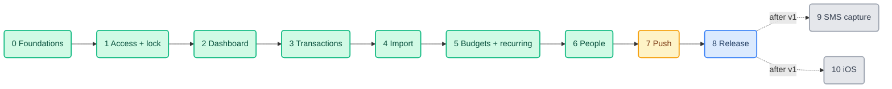

# 03 · Development Plan

> **Last reviewed** 2026-10-05 · Read [01-requirements.md](01-requirements.md) and
> [02-technical-design.md](02-technical-design.md) first. Phase numbers here are
> the ones used in the other two files.

## 1. The flow

Each phase ends at a **gate**: something that can be run or looked at, not a
feeling. A phase is not finished until its gate passes and its docs are updated.

Phases 1–6 can each ship to the sideloaded APK as soon as their gate passes, so
the household can use it while later phases are built. Phase 7 is the only one
that touches the server. Sizes: **S** a sitting · **M** a few sittings · **L** a
week or more of evenings.

### How every phase runs

1. **Read** the requirement IDs and the API rows it touches.
2. **Build the smallest thing that passes the gate.** Copy a pattern from an
   earlier phase before inventing one.
3. **Verify:** `flutter analyze`, `flutter test`, and run it on the emulator. For
   anything that renders, look at it in light **and** dark.
4. **Docs** in the same turn: tick the status log in `README.md`, and any repo
   doc the change touches (table in `README.md`).
5. **Hand off** with the build command for the APK, never a `git push`.

## 2. Phases

### Phase 0 — Foundations · M

> **State 2026-10-05:** 0.1, 0.2, 0.4, 0.5, 0.6, 0.8 done. 0.7 built, waiting on
> Arjun's approval of `screenshots/phase0-*.png`. **0.3 is Arjun's** and blocks
> production sign-in (Phase 1 gate), not development. Deviations from the table:
> 0.2 added only the packages Phase 0 uses (`flutter_riverpod`, `http`, `intl`,
> `shared_preferences`, `firebase_core`, `firebase_auth`); the rest arrive with the
> phase that needs them, so no phase carries Android config it does not use.
> `intl` is installed but unused so far (date formatting is hand-written and the
> money grouping is BigInt-safe by hand); remove it at Phase 2 if still unused.
> Fonts are the system serif and sans; Geist is `.woff2` on the web and Flutter
> needs `.ttf`, so bundling it is an optional later step.

| # | Task | Who |
|---|---|---|
| 0.1 | Create the project: `flutter create --platforms=android --org com.paisa --project-name paisa_mobile app` inside `Mobile App/`; set `namespace` **and** `applicationId` to `com.paisa.mobile`; `.gitignore` for `*.jks`, `key.properties`, `local.properties` | Claude |
| 0.2 | Add the packages in design §1; add the debug manifest cleartext allowance; switch `MainActivity` to `FlutterFragmentActivity`; add `USE_BIOMETRIC` and `POST_NOTIFICATIONS` | Claude |
| 0.3 | Register the Android app in Firebase (`paisa-easylance`, package `com.paisa.mobile`, add the debug SHA-1), drop `google-services.json` into `app/android/app/` | **Arjun** |
| 0.4 | Run the API locally in dev mode and **record real responses** for `/me`, `/books`, `summary`, `transactions`, `budget-plan`, `recurring-plans`, `memberships`, `invitations`, `imports` into `test/fixtures/`. Resolve every *(confirm)* in design §4: `GET /books` fields, which capability "confirm" needs | Claude |
| 0.5 | `money.dart` and `time.dart` with their tests (grouping, sign, paise, midnight-in-timezone) | Claude |
| 0.6 | `ApiClient` + `ApiError` + status mapping from design §4, tested with recorded fixtures | Claude |
| 0.7 | Light and dark `ColorScheme`s and text styles from the tokens; **one mock screen in both modes for Arjun to approve** | Claude, then **Arjun** |
| 0.8 | Create an Android emulator (the API 36 system image is already on this Mac) and confirm the app boots | Claude |

**Gate:** `flutter analyze` clean · tests pass · the app boots on the emulator and
`GET /me` succeeds against the local API via dev auth · Arjun has approved the dark
mock. **Docs:** `README.md` status log, `CLAUDE.md` layout, `docs/architecture.md`,
`docs/design.md` (dark tokens), `TODO.md`.

### Phase 1 — Access and lock · M

| # | Task | Req |
|---|---|---|
| 1.1 | Session provider: Firebase user → `/me` → `/books` → selected book and role, persisted | X5 |
| 1.2 | Sign-in screen, forgot password, sign out | X1 X3 X6 |
| 1.3 | Request-access sheet with the three replies and the `429` message | X2 |
| 1.4 | "No household yet" screen for `403 INVITE_REQUIRED` | X4 |
| 1.5 | Book picker | X5 |
| 1.6 | App lock gate: biometric or device PIN, grace period setting, `FLAG_SECURE` | X7 |
| 1.7 | Role helper: one place that answers "can this role do X", used by every later screen | — |

**Gate:** sign in on a real phone with Arjun's account against **production**
(read-only: `/me`, `/books`) · request access against the local API shows all three
replies · lock engages after backgrounding · a `viewer` test account sees no edit
controls. **Ship:** first sideloadable APK.

### Phase 2 — Dashboard · M

| # | Task | Req |
|---|---|---|
| 2.1 | Month navigator driven by `period` from the response; label follows the pay cycle | D-1 |
| 2.2 | Four tiles, formatted by `money.dart` | D-2 |
| 2.3 | Breakdown (donut or stacked bar) from `byCategory` with the group swatches; assert in a test that it sums to `spent + moved` as the server does | D-3 |
| 2.4 | Budget progress against the % plan | D-4 |
| 2.5 | "N payments need review" card linking to the filtered list | D-5 |
| 2.6 | Error state: data cleared, actions disabled, retry | D-6 |
| 2.7 | Light and dark pass on every widget here | E1 |

**Gate:** the numbers equal what the web dashboard shows for the same book and
month (check two books and two months, including one across a pay-cycle boundary)
· airplane mode shows the error state with no figures. **Docs:** `docs/design.md`
phone type scale.

### Phase 3 — Transactions · L

| # | Task | Req |
|---|---|---|
| 3.1 | Paged list with state filter chips, pull to refresh, infinite scroll on `nextCursor` | T1 |
| 3.2 | Client-side search over what is loaded; say so when more pages exist | T2 |
| 3.3 | Detail screen: amount with sign, source, category, splits, comments | T3 |
| 3.4 | Review actions gated by role: confirm, category with "apply to future", void with a two-step confirm | T4 |
| 3.5 | Edit form: kind and amount change together, date anchored to the book's timezone | T5 |
| 3.6 | Split editor: parts must add up to the amount | T6 |
| 3.7 | Comments | T7 |
| 3.8 | Add manual transaction, one `Idempotency-Key` per form submission reused on retry | T9 |

**Gate:** as `editor`, review ten real pending payments end to end and see each
reflected on the web · as `viewer` and `reviewer`, the forbidden actions are
absent · a retried manual add after a dropped connection creates **one** row.
Optional but wanted: API change #2 (month filter) lands here if paging proves
slow.

### Phase 4 — Statement import · M

| # | Task | Req |
|---|---|---|
| 4.1 | File picker restricted to CSV and .xlsx; PDF refused with the reason | T8 |
| 4.2 | Account picker (optional), size check against the 2.2 MB xlsx ceiling, SHA-256, base64 for xlsx | T8 |
| 4.3 | Result screen: imported, duplicates, each warning | T8 |
| 4.4 | Server errors `413` and `422` shown verbatim | T8 |

**Gate:** import the SBI CSV and the HDFC .xlsx used in the web's verification
(**from Arjun's own files, not committed**) → 0 warnings and the same row counts as
the web (17 and 172) · importing the same file again gives `imported: 0`.

### Phase 5 — Budgets and recurring · M

| # | Task | Req |
|---|---|---|
| 5.1 | % plan editor with a running total and the 100% cap, 50/30/20 preset as the web has | B1 |
| 5.2 | Expected income line from `baseIncomeMinor` | B2 |
| 5.3 | Recurring list, create, edit, stop (`active:false`) | R1 |

**Gate:** a plan saved on the phone appears unchanged on the web and vice versa.

### Phase 6 — People and access · S

| # | Task | Req |
|---|---|---|
| 6.1 | Members list with roles | P1 |
| 6.2 | Change role, remove (two-step), with the server's `SELF_ACCESS_CHANGE` / `LAST_OWNER` messages shown | P2 |
| 6.3 | Invite by email and role; pending invitations; revoke. The invite **token** is returned once at creation, so show how to share the link and do not store it | P3 |

**Gate:** invite a second account, accept on the web, see it appear in the list,
change its role, remove it.

### Phase 7 — Push notifications · L (touches the server)

Server first, then the client. Details in design §8.

| # | Task | Who |
|---|---|---|
| 7.1 | Add the **Firebase Cloud Messaging API Admin** role to the existing service account | **Arjun** |
| 7.2 | Migration for `DeviceToken`, device routes, sender, trigger after import and recurring posting, test, both stores in agreement | Claude |
| 7.3 | Docs: `docs/architecture.md` (routes, schema, migrations list), `docs/memory.md` (the decision and the audit-gap call) | Claude |
| 7.4 | **Deploy:** `./deploy/migrate.sh` first, then `./deploy/deploy.sh` | **Arjun** |
| 7.5 | Client: permission prompt at a sensible moment, token registration, refresh, unregister on sign-out, tap opens pending review | Claude |

**Gate:** import a statement from the web with the phone locked → one
notification arrives within a minute saying how many need review → tap lands on
the filtered list · declining the permission leaves the app fully working · after
sign-out, no further notifications reach that phone.

### Phase 8 — Hardening and release · M

| # | Task | Who |
|---|---|---|
| 8.1 | Accessibility pass: labels, font scaling to 200%, 48dp targets, status never colour-only | Claude |
| 8.2 | Dark mode audit on every screen | Claude |
| 8.3 | R8 keep rules; **test the release build** on a real phone (Firebase, biometrics, notifications, `FLAG_SECURE`) | Claude |
| 8.4 | Create the upload keystore; **Arjun keeps two backups outside the repo** — losing it blocks every future update | **Arjun** |
| 8.5 | Add the release SHA-1 to Firebase; build the signed APK (`flutter build apk --release`) for the sideload channel | Claude, **Arjun** |
| 8.6 | Play Console developer account; build the AAB (`flutter build appbundle --release`); upload to **internal testing** | **Arjun** |
| 8.7 | Play listing basics: the privacy policy URL (the web already serves one), the Data Safety form (financial info collected, encrypted in transit, not shared), content rating | **Arjun**, Claude drafts |
| 8.8 | Retire `apps/mobile` once the new app is on the household's phones — **only with Arjun's yes**, because it holds the SMS code Phase 9 reuses. Move that code aside first | **Arjun** |

**Gate:** the household installs the APK **and** a Play internal-testing build;
both sign in, show real numbers, lock, and receive a notification.

> **One channel per phone.** The sideloaded APK is signed with the upload key;
> Play re-signs with its own key. Android refuses to update one over the other, so
> each device uses one channel and uninstalls before switching.

### Phase 9 — SMS capture (after v1) · L

Android only. Goal is the product's original promise: a payment in the ledger
within a minute, with no typing.

- Port the Kotlin receiver, queue and bridge from `apps/mobile` into `app/android`
  behind `lib/platform/` so iOS gets a no-op.
- **One parser, not two.** `TODO.md` flags the Kotlin and Dart copies as drifting.
  Keep the Kotlin one (it runs when the app is closed), delete the Dart one, and
  test against **10–20 real, redacted bank SMS** (Arjun supplies them).
- Background upload via WorkManager; foreground reliability on aggressive OEM
  battery managers needs testing on the household's actual phones.
- Upload to `POST …/ingestion-events` using the real book and a real token. The
  server dedupes on `(workspaceId, sourceHash)`.
- Decide the audit-trail question for ingestion first (`TODO.md`: ingestion events
  write no audit row).
- `READ_SMS` / `RECEIVE_SMS` appear in the manifest for the first time. The Play
  restricted-permission declaration is weeks of lead time — **start it during
  Phase 8**. The sideloaded APK is unaffected.
- SMS becomes a push trigger too (design §8).

**Gate:** pay by UPI, watch the row appear on the dashboard in under a minute with
the app closed.

### Phase 10 — iOS · L

- `flutter create --platforms=ios .` inside `app/`.
- Needs from Arjun: Apple Developer account, an iOS app registered in Firebase, an
  APNs key uploaded to Firebase for push.
- Everything in `features/` and `core/` should already work. What differs:
  Face ID usage description, push entitlement, no SMS capture (iOS cannot read
  SMS — the app is a viewer, reviewer and importer there), TestFlight instead of
  Play.
- Statement import is the iOS capture path, which makes Phase 4 quality matter.

## 3. Arjun's steps in one list

| When | Step |
|---|---|
| Phase 0 | Register the Android app in Firebase, add the debug SHA-1, hand over `google-services.json` |
| Phase 0 | Approve the dark-mode mock |
| Phase 1 | Give me a `viewer` and a `reviewer` test login so role gating can be tested |
| Phase 4 | Provide your own SBI / HDFC statement files for the gate. They stay out of the repo |
| Phase 7 | Add the FCM role to the service account; run `migrate.sh` then `deploy.sh` |
| Phase 8 | Create and back up the keystore; Play Console account; add the release SHA-1 |
| Before Phase 9 | 10–20 redacted real bank SMS; start the Play SMS declaration |
| Any time | Disable public sign-up in Firebase (`TODO.md`) |

## 4. Risks

| # | Risk | Mitigation |
|---|---|---|
| R1 | **App Check vs sideloading.** Play Integrity does not attest a sideloaded APK, so turning `APP_CHECK_MODE=enforce` on would lock out the sideload channel | Keep it `off` for the mobile launch (it is off in `deploy/paisa.env.example`). Revisit only if the app moves to Play-only |
| R2 | **Two install channels can't update each other** (signature differs) | One channel per device; documented in Phase 8 |
| R3 | **FCM needs a wider service-account role and a migration**, on a shared host with no CI | Arjun's explicit step in Phase 7; `deploy.sh` already refuses to restart if the schema is behind |
| R4 | **No server month filter** on transactions, so a phone pages the whole ledger | API change #2; measure in Phase 3 before building it |
| R5 | **Firebase Android registration blocks production sign-in** | Phases 0–2 can run against the local API with dev auth while that step is pending |
| R6 | **Dev auth in a build** could ever reach the household | `kDebugMode` guard plus a `--dart-define`; a release-build test asserts the dev header is never sent |
| R7 | **R8 shrinking** breaks Firebase or the platform channel only in release | Test the release build in Phase 8, and earlier on each shared APK |
| R8 | **Play policy for new personal developer accounts** has required a closed test with a minimum number of testers for a stretch before production access | Not a blocker for internal testing, which is all v1 needs. Check the current rule in Play Console before planning any public release |
| R9 | **Body text sized for a laptop** (10–12 px) is unreadable on a phone | 12 sp floor, 14 sp body, fonts scale with the system setting |
| R10 | **Path contains spaces** (`Mobile App/`, `Financial App/`) | The old app already built fine under `Financial App/`. If a Gradle or script step breaks, quote the path rather than rename the folder |
| R11 | **Dark mode is unspecified** and the web has none | Mock first, approval in Phase 0, then write it into `docs/design.md` |
| R12 | **SMS permission approval** can take weeks | Start in Phase 8; it only blocks the Play channel in Phase 9, not the sideload |

## 5. Open items

All of these have a default in `01-requirements.md` §7; none blocks Phase 0.

- A1–A7 assumptions awaiting a yes or a correction.
- Exact Android minimum SDK: Flutter's default is assumed.
- Whether to render the donut with a package or a small `CustomPainter` (decide in
  Phase 2; a painter is about 40 lines and avoids a dependency).
