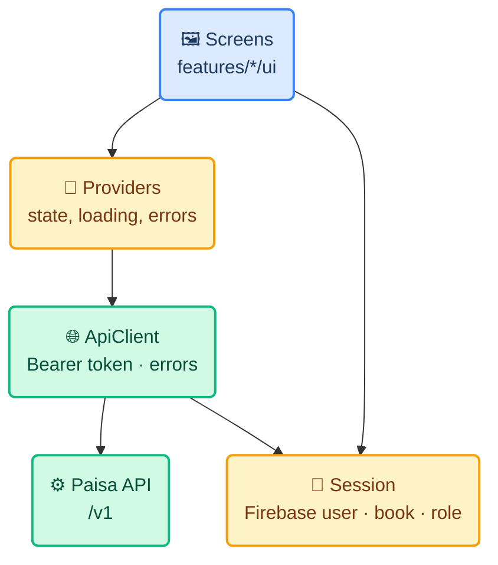
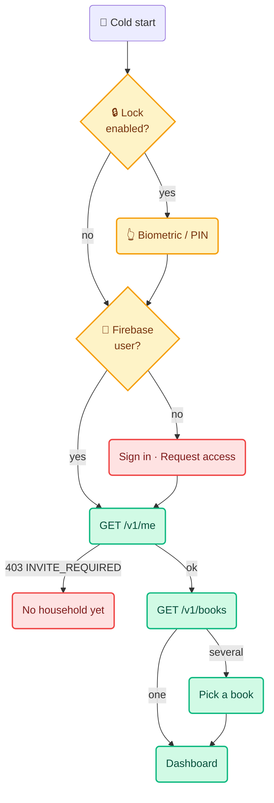

# 🏛️ Mobile Architecture

**Paisa Mobile — Android app**

How the phone app is built: stack, folder layout, how each screen maps to an API
route, authentication, security, push notifications, and what the server is missing.
The server side is described in the repo's [`docs/architecture.md`](../../docs/architecture.md).

> **Last reviewed** 2026-10-05 · Everything about the API was read from `apps/api`
> and recorded from a running copy of it, never guessed. Where a feature is not
> built yet the section says so.

---

## 1. Stack

| Layer | Choice | Built | Why |
|---|---|---|---|
| Language / UI | Dart 3.10 + Flutter 3.38 | ✅ | Installed here; Android now, iOS later from one codebase |
| State | `flutter_riverpod` 3 | ✅ | The signed-in session, the chosen book, the month and the lock are shared by most screens; one dependency covers state, async loading and caching |
| Navigation | Plain `Navigator` + a `SessionGate` widget | ✅ | Four tabs and a few pushed screens. Move to `go_router` only when invitation deep links arrive |
| HTTP | `http` | ✅ | One wrapper (`ApiClient`), no interceptors needed |
| Auth | `firebase_core`, `firebase_auth` | ✅ | Same Firebase project as the web |
| App lock | `local_auth` | ✅ | The phone's own biometric or screen-lock prompt |
| Preferences | `shared_preferences` | ✅ | Theme, last book, lock settings. None of it sensitive |
| Formatting | hand-written | ✅ | Money grouping is BigInt-safe by hand; `intl` was removed in Phase 3 because nothing used it |
| File picking, hashing | `file_picker`, `crypto` | ⛔ Phase 4 | Statement import |
| Push | `firebase_messaging` | ⛔ Phase 7 | FCM |
| Crash reports | `firebase_crashlytics` | ⛔ Phase 8 | Needs its Gradle plugin; added with release hardening |
| Fonts | System serif for headings, system sans for the rest | ✅ | No runtime font fetch and no Google call from a finance app. Geist ships as `.woff2` on the web and Flutter needs `.ttf`, so bundling it is an optional polish |

**Left out on purpose:** code generation (`freezed`, `json_serializable`,
`build_runner`) because the models are small and hand-written ones fail loudly with
no build step; `dio`; `google_fonts`; a local database (no offline cache in v1);
`flutter_secure_storage` (nothing sensitive is stored: Firebase holds the session);
a DI framework beyond Riverpod. Packages are added by the phase that uses them, so no
phase carries Android configuration it does not need.

---

## 2. Folder layout

```text
Mobile App/
├── README.md                     start here
├── docs/                         prd · architecture · rules · design · tasks · memory
│   ├── findings.md               things found that change the plan, with a status
│   ├── firebase-android-setup.md registering the Android app in Firebase
│   └── screenshots/              what each phase looked like
└── app/                          the Flutter project, Android-only at first
    ├── pubspec.yaml
    ├── lib/
    │   ├── main.dart             Firebase init, preferences, ProviderScope (retry off)
    │   ├── app.dart              MaterialApp, themes, SessionGate, the lock above the navigator
    │   ├── core/
    │   │   ├── api/              api_client.dart (ApiClient, ApiError, AppConfig) · models.dart
    │   │   ├── auth/             auth_service.dart (Firebase, development and fake-able)
    │   │   ├── session.dart      SessionState, SessionController, bookProvider
    │   │   ├── money.dart        paise <-> BigInt, Indian formatting, sign rules
    │   │   ├── time.dart         BookClock, currentPeriodLabel, month labels
    │   │   ├── prefs.dart        the SharedPreferences provider
    │   │   ├── widgets.dart      PaisaMark, Notice, ErrorPanel
    │   │   └── theme/            tokens.dart (colours) · theme.dart · theme_mode.dart
    │   └── features/
    │       ├── access/           sign in, request access, no household, book picker
    │       ├── home/             the four-tab shell
    │       ├── dashboard/        logic (pure) · providers · view
    │       ├── activity/         the ledger: list, detail, edit/add form, split editor, category sheet; logic (pure) · providers (paging, writes)
    │       ├── settings/         account, theme, lock, abilities, sign out
    │       ├── lock/             controller + the gate that covers the app
    │       └── phase0/           theme_preview.dart — throwaway, debug-only
    ├── test/                     unit + widget tests; support/fakes.dart; fixtures/ (recorded API JSON)
    └── android/                  applicationId com.paisa.mobile
```

A feature folder owns its screens, its providers and its API calls. `core/` knows
nothing about features. The dashboard keeps its rules in `dashboard_logic.dart`, which
has no widgets, so every rule is tested directly. Anything that differs per
operating system will live in `lib/platform/` behind an interface (SMS capture in
Phase 9, the iOS differences later), so the rest of the code never asks which OS it
is on.

---

## 3. Layers



All business rules stay on the server. The app **displays and submits**; it
does not recompute totals, categorise, or decide what counts as spending. The
one thing it mirrors is formatting.

## 4. Screen → API map

Base URL comes from `--dart-define=API_URL=…`; production is
`https://paisa.easylancefreelance.com`. Routes are under `/v1`. "Needs" is the
minimum role; the API checks it again regardless.

**Built so far:** request access, sign in, forgot password, book picker, dashboard,
budget progress (Phases 1–2). The rest follow in their own phases: transactions 3,
import 4, budgets and recurring 5, people 6, notifications 7. Always send `month` to
the summary: without it the response has no `period` and the window cannot be shown.

| Screen | Calls | Needs |
|---|---|---|
| Request access | `POST /v1/access-requests` — **no token.** Body `{name, email}`. Replies `received` (201), `pending`, `granted`. Rate limit 5 per 10 min per IP, so handle `429` | public |
| Sign in | Firebase `signInWithEmailAndPassword`, then `GET /v1/me` | — |
| Forgot password | Firebase `sendPasswordResetEmail` | — |
| Book picker | `GET /v1/books` → `items[]`: `id, workspaceId, name, visibility, currency, timezone, periodStartDay, role` (**confirmed** in both stores, Phase 0) | member |
| Dashboard | `GET /v1/books/:id/summary?month=YYYY-MM` → `incomeMinor`, `spentMinor`, `movedMinor`, `balanceMinor`, `pendingReview`, `byCategory`, `byAccount`, `flows`, `period{month,startDay,startsAt,endsAt}` | viewer |
| Budget progress | `GET /v1/books/:id/budget-plan` → `items[{groupName, percent}]`, `baseIncomeMinor` | viewer |
| Transaction list | `GET /v1/books/:id/transactions?state=&limit=&cursor=` → `{items, nextCursor}`; each item carries `comments`. Max `limit` 100 | viewer |
| Review: category | `PATCH …/transactions/:tid/category` `{categoryId, applyToFuture}` | reviewer |
| Review: edit | `PATCH …/transactions/:tid` — any of `merchant, note, amountMinor, kind, occurredAt, state, accountId, counterAccountId`. **`amountMinor` and `kind` must be sent together.** `state: 'voided'` voids | editor |
| Review: confirm | **Choosing a category confirms it**: `PATCH …/category` sets `state: 'confirmed'` in the same write (that is what the web does), so a **reviewer** can confirm. A bare `PATCH {state:'confirmed'}` needs editor and is only for a payment that already has the right category | reviewer / editor |
| Split | `PUT …/transactions/:tid/splits` `{splits:[{categoryId, amountMinor, note?}]}`, 2–20 parts | reviewer |
| Comment | `POST …/transactions/:tid/comments` `{body}` | reviewer |
| Add manual | `POST …/transactions` — needs an `Idempotency-Key` header (≥8 chars) | editor |
| Import | `POST …/imports` — see §5 | editor |
| Accounts / categories | `GET …/accounts`, `GET …/categories` (read-only, to fill pickers) | viewer |
| Budgets | `PUT …/budget-plan` `{allocations:[{groupName, percent}]}`, ints 0–100, total ≤ 100 | editor |
| Recurring | `GET/POST …/recurring-plans`, `PATCH …/recurring-plans/:pid` (stop with `active:false`; there is no DELETE) | viewer / editor |
| People | `GET …/memberships`, `PATCH/DELETE …/memberships/:userId`, `GET/POST …/invitations`, `DELETE …/invitations/:id` | `manage_book` |
| Notifications | `POST /v1/me/devices` and its delete — **does not exist yet**, see §8 | any |

### Error handling

Every API error is `{code, message, details?}`. The app branches on **HTTP
status and `code`, never on the message text** (a rule from the web code).

| Status / code | App behaviour |
|---|---|
| `401` | Force-refresh the Firebase token once and retry; second 401 signs out |
| `403 INVITE_REQUIRED` | The "no household yet" screen (X4) |
| `403` on a book route | A role changed under the user; refetch `/books` and re-gate |
| `404` | "That is not available to you" — a missing membership looks like a missing book by design |
| `400 VALIDATION_ERROR` | Show `details.fieldErrors` against the form fields, not a toast |
| `409 SELF_ACCESS_CHANGE`, `LAST_OWNER`, `IDEMPOTENCY_CONFLICT` | Show the server's message; it already says what to do |
| `413 STATEMENT_TOO_LARGE`, `422 STATEMENT_UNPARSEABLE` | Show the server's message verbatim |
| `429` | "Try again in a few minutes" |
| `5xx` / network | Page-level error state, actions disabled, no stale numbers |

## 5. Statement import on the phone

The server contract (`apps/api/src/app.js`, `importInput`):

| Field | Rule |
|---|---|
| `fileName` | 1–180 chars |
| `contentType` | `text/csv`, `application/vnd.openxmlformats-officedocument.spreadsheetml.sheet`, or `application/pdf` |
| `sizeBytes` | positive int, ≤ 10 MB |
| `sha256` | 64 hex chars of the file |
| `content` | CSV as text; **.xlsx as base64**; max 3 MB as a *string* |
| `accountId` | optional |

Consequences for the app:

- A **.xlsx over about 2.2 MB is rejected** — base64 inflates by a third, and the
  string cap is 3 MB. Check before uploading and say so; the web has the same
  limit.
- **PDF cannot be parsed** (the API says so). Block PDFs in the picker with the
  reason, do not upload them.
- The server caps a file at **2,000 rows**; surface its message on `413`.
- The reply includes `imported`, `duplicates`, `warnings[]`. A warning means a
  row's running balance did not reconcile, and the row was still imported: show
  both numbers and the warnings, in the web's words ("17 entries imported, 3
  already in the ledger").
- Re-importing the same file is safe: dedupe is per row.

## 6. Authentication and session



- The ID token is fetched with `getIdToken()` before **every** request; the SDK
  caches and refreshes it, so the app never stores a token itself. A `401` is retried
  once with a forced refresh; a second one signs the person out.
- The app lock is local. It gates the UI; it does not replace or extend the
  Firebase session. The grace period (every time, 1 or 5 minutes; default 1) is a user
  setting. A cold start is locked when the lock is on; signing in does not ask again.
- Sign-up is not offered. Firebase public sign-up should be disabled in the
  console (it is also a `TODO.md` item for the web).
- **Sign-out clears** the selected book and, from Phase 7, the FCM device
  registration (§8), so the next person on the phone inherits nothing.

### 6.1 State and providers

`AuthService` is the one door to "who is signed in and what headers prove it". It has
a Firebase implementation, a development one (`AppConfig.devAuth`, debug only) and a
test fake, so the app, the tests and local development all go through the same code.

`SessionController` (an `AsyncNotifier`) turns that into the screen to show. The
screens switch on `SessionState` and nothing else:

| State | Means | Screen |
|---|---|---|
| `SignedOut` | No Firebase user, or a token the API will not accept | Sign in |
| `NoHousehold` | Signed in, `403 INVITE_REQUIRED` | No household yet |
| `Ready(book: null)` | Several books, none chosen | Book picker |
| `Ready(book)` | The normal case | The four-tab shell |
| *error* | The API could not be reached or failed | `ErrorPanel`, no data |

The chosen book is remembered in preferences and forgotten on sign-out. Everything
below the picker works on `bookProvider`. The dashboard's month is **not** read from
the session: its providers take the book's `timezone` and `periodStartDay` as an
argument (`PeriodKey`), because during sign-out the session has no book for a moment
while the dashboard is still on screen.

Two Riverpod 3 behaviours matter: a provider nothing listens to is **paused** (tests
must `listen` first), and a failed provider **retries by itself** (`retry` is switched
off on the `ProviderScope`, so an error shows once). See `memory.md` §3.

## 7. Security

| Control | Detail |
|---|---|
| Transport | HTTPS only in release builds. The emulator-to-localhost HTTP address (`10.0.2.2`) is allowed in the **debug** manifest only |
| Logging | Never log tokens, amounts, merchants, or response bodies. Crashlytics gets stack traces only, with custom keys limited to screen name |
| Screenshots / recents | `MainActivity` sets `FLAG_SECURE` on non-debuggable builds, so the recents thumbnail and screen recordings do not show balances. Verified on a release build; debug builds are left open so they can be screenshotted. Revisit if it annoys the household |
| Dev auth | Local development uses the API's `AUTH_MODE=dev` (`x-dev-user-id` header). `AppConfig.devAuth` is `kDebugMode && DEV_AUTH`, a compile-time constant, so it **cannot be reached in a release build**: checked by searching the release binary, which holds neither the header name nor the emulator address |
| Secrets | `google-services.json` names the project and carries a client key that identifies it, not a credential; it is committed with the app. The signing keystore and `key.properties` are never in the repo (`.gitignore`) |
| Minification | Release builds shrink with R8. Firebase and the platform channel need keep rules; test a **release** build before every distribution |
| App Check | The API's code default is `enforce`, but the deployed config sets `APP_CHECK_MODE=off`. **Keep it off for the mobile launch.** Play Integrity does not recognise sideloaded APKs, so enforcing it would lock out the sideload channel (see plan risk R1) |

## 8. Push notifications (FCM)

Not built on either side yet. This is the only feature that changes the server.

**Client**

1. On sign-in, after the user accepts the Android 13+ `POST_NOTIFICATIONS`
   prompt, get the FCM token and `POST /v1/me/devices {token, platform}`.
2. Re-register whenever the token refreshes; unregister on sign-out.
3. A notification tap opens the Transactions tab filtered to *pending review*.
4. Declining the prompt is fine: the in-app "N payments need review" card still
   works.

**Server** *(new, needs `./deploy/migrate.sh` before `deploy.sh`)*

| Piece | Detail |
|---|---|
| Table | `DeviceToken(id, userId, token unique, platform, createdAt, lastSeenAt)` — one migration |
| Routes | `POST /v1/me/devices` (upsert on token), `DELETE /v1/me/devices/:token` |
| Sender | FCM HTTP v1 over `fetch`, authenticated with the **same service-account JWT approach as `domain/firebase-admin.js`** — `jose` is already installed, so no `firebase-admin` package, consistent with `docs/memory.md` |
| Key scope | The service account today has only *Firebase Authentication Admin*. Sending needs the **Firebase Cloud Messaging API Admin** role added in the console — a deliberate widening of what the key can do, so it is Arjun's call |
| Trigger | After an **import** finishes or a **recurring plan** posts, send one message to the book's members who can review: "12 payments need review". Never one per row. Phase 9 adds SMS as a trigger |
| Delivery rules | Delete tokens FCM reports as `UNREGISTERED`. Only members of the book get a message about the book |
| Audit | Device registration is a mutation without an audit row; the repo's own rule lists seven such gaps already. Decide per route, and record the decision in `docs/memory.md` |
| Tests | One test in `apps/api/test/api.test.js` with the memory store: register, import, a message is composed for each eligible member and none for others |

## 9. API changes the mobile app wants

Ordered by how much each one matters. Only #1 is required for v1 as specified;
the rest are improvements that can follow.

| # | Change | Why |
|---|---|---|
| 1 | Device-token routes + sender (§8) | Push notifications are in v1 |
| 2 | `month` query on `GET /transactions`, reusing `periodRangeUtc` | The list filters only by `state`. Showing "this month's" transactions means paging through the whole ledger on a phone |
| 3 | `GET /books/:id/transactions/:tid` | Already in `TODO.md`. Needed to open a transaction from a notification without loading a list |
| 4 | ~~Include `timezone` and `periodStartDay` in `GET /books` items~~ | **Resolved** — both stores already return the whole book plus `role` |
| 5 | Correct `CLAUDE.md` | It says `Idempotency-Key` is ignored in production. `prisma-store.createTransaction` **does** honour it for 24 h via `IdempotencyRecord`; only `POST /ingestion-events` relies on `sourceHash` alone. Mobile can rely on one key per form submission for manual adds |

Each API change follows the repo's rules: both stores kept in agreement, shared
logic in `src/domain/`, a test, and the docs table in `CLAUDE.md` updated.

## 10. Theme

The colours, type scale and dark palette are in [`design.md`](design.md). In code the
tokens are `core/theme/tokens.dart` (a `ThemeExtension` the `ColorScheme` has no slot
for) and `core/theme/theme.dart` (one `ColorScheme` and text theme per mode). A test
(`test/theme_test.dart`) fails if body or secondary text drops under 4.5:1 on either
background, in either mode.

---

## 11. Money and time helpers

Two small, heavily tested files, because the web notes say this is where bugs
have been.

- `money.dart`: parse `"-190100"` to `BigInt`; format to `−₹1,901`; paise shown
  only when non-zero; Indian grouping. **No `double` anywhere on an amount.**
  Sending an amount: expense negative, income and refund positive, and `kind`
  and `amountMinor` change together.
- `time.dart`: format a UTC instant in the **book's** timezone (`BookClock`); build a
  date-only value as midnight in that timezone; send as ISO-8601 with an offset;
  label a month (`monthLabel`, `shiftMonth`); and `currentPeriodLabel`, a port of the
  API's pay-cycle function. `BookClock` knows only fixed-offset zones (Asia/Kolkata and
  UTC; anything else is treated as Kolkata): marked with a `ponytail:` comment, and
  fine because Paisa is India-only. Add the `timezone` package if a book outside India
  ever exists.
- **A port of server logic is never trusted on its own.** `currentPeriodLabel` is
  checked against `test/fixtures/period_labels.json`, recorded from the real
  `period.js`; regenerate that file if the API function changes.

## 12. Build configuration

| Flag | Meaning |
|---|---|
| `--dart-define=API_URL=…` | Server root. Default: `http://10.0.2.2:4000` in a debug build, `https://paisa.easylancefreelance.com` otherwise |
| `--dart-define=DEV_AUTH=true` | Debug only: skip Firebase and send `x-dev-user-id`, for running against a local `npm run serve`. The "email" box then takes a dev user id (`user_owner`, `user_ca`, …) |
| `--dart-define=DEV_USER_ID=…` | Which dev user a dev build starts as (default `user_owner`) |

Firebase is initialised in `main()` unless `DEV_AUTH` is on; there is no separate
switch. A build without `google-services.json` still compiles (the Gradle plugin is
applied only when the file exists) but Firebase is then not configured.

Android specifics, all in place:

- `namespace` and `applicationId` are both `com.paisa.mobile` (the old app mixed
  `com.paisa.paisa_mobile` and `com.paisa.mobile`).
- `INTERNET` is in the **main** manifest; cleartext HTTP is allowed in the **debug**
  manifest only, so the emulator can reach `10.0.2.2` and a release build cannot.
- `MainActivity` extends `FlutterFragmentActivity`, which `local_auth` needs;
  `USE_BIOMETRIC` comes from the plugin's own manifest.
- Still to add: `POST_NOTIFICATIONS` for Android 13+ (Phase 7).
- No `READ_SMS` / `RECEIVE_SMS` in v1.

### Built so far: how the ledger screens use these routes

- **Paging** is cursor-based: `nextCursor` is the id of the last row sent. The list
  asks for 50 and loads more on scroll or on "Load older payments". A failed later
  page keeps what is shown and offers a retry; a failed first page is an error panel.
- **There is no route to fetch one payment.** A write's answer is the only fresh copy,
  and the answers are not uniform: `PATCH …/category` and `PUT …/splits` return the
  payment **without `comments`** (the category route also without `splits`), `PATCH
  …/transactions/:id` returns everything. The phone merges a response over what the
  screen already holds (`Transaction.fromJson(json, previous:)`); see `findings.md` F16.
- **After any write** the open list takes the new version (a confirmed payment leaves
  the "Needs review" chip) and the dashboard's summary is fetched again.
- **A manual payment's `Idempotency-Key`** is generated once per form and kept across
  a lost connection. A definitive answer from the server (any status) replaces it,
  because that attempt was seen and refused; `409 IDEMPOTENCY_CONFLICT` (same key,
  changed body) is explained to the person. Only the Prisma store enforces body
  equality; the memory store ignores it.
- **The server does not stop a split payment's amount being edited** (F17), so the
  phone locks type and amount on a split payment.

## 13. Testing

205 tests, run with `flutter test` from `Mobile App/app`. The rules that keep them
honest are in [`rules.md`](rules.md) §6.

| Kind | Where | Covers |
|---|---|---|
| Unit | `money_test`, `time_test`, `api_client_test`, `models_test`, `dashboard_logic_test`, `theme_test` | Grouping, sign and paise; the pay-cycle label against 1,276 recorded API cases; error mapping and the 401 retry; model parsing against recorded responses; breakdown and budget maths; contrast |
| Session | `session_test` | Signed out, one book, several books, a remembered book, no household, a token that stays invalid, a server error, sign-out |
| Lock | `lock_test` | The controller (grace period, the prompt backgrounding the app) and the lock screen over a signed-in app |
| Ledger | `activity_logic_test`, `activity_test` | Search, labels, the edit patch (kind and amount together), the create body, error sentences; the list at 360dp (paging, filters, errors), what each role is offered, confirm / category / void / comment / edit / add / split through a fake server, and a retry after a dropped connection creating one row |
| Screens | `access_test`, `dashboard_test` | Sign in, request access, role gating, errors, the dashboard at 360dp in light and dark, month navigation, pay cycles, empty and error states |
| Fixtures | `test/fixtures/` | Responses **recorded from a running copy of the API**, never hand-written: `me`, `books`, `summary`, `summary_rich`, `transactions`, `budget_plan`, `budget_plan_set`, `recurring_plans`, `memberships`, `invitations`, `accounts`, `categories`, and `period_labels` (from the real `period.js`) |
| Harness | `test/support/fakes.dart` | A scripted API (`FakeServer`), a fake sign-in, a fake phone prompt, a fixed clock. A fixture changing is the signal the API moved |
| On a device | by hand | A release build on a real phone before every distribution, because debug and release differ (R8, the secure window, biometrics) |

Run before saying a phase is done: `flutter analyze`, `flutter test`, a run on the
emulator, and for a release a `flutter build apk --release` smoke install. API changes
also run the repo's `npm run test` and `npm run lint`. Never use real financial data
as a fixture: record from the sample data in the memory store, or build one in the
test.
