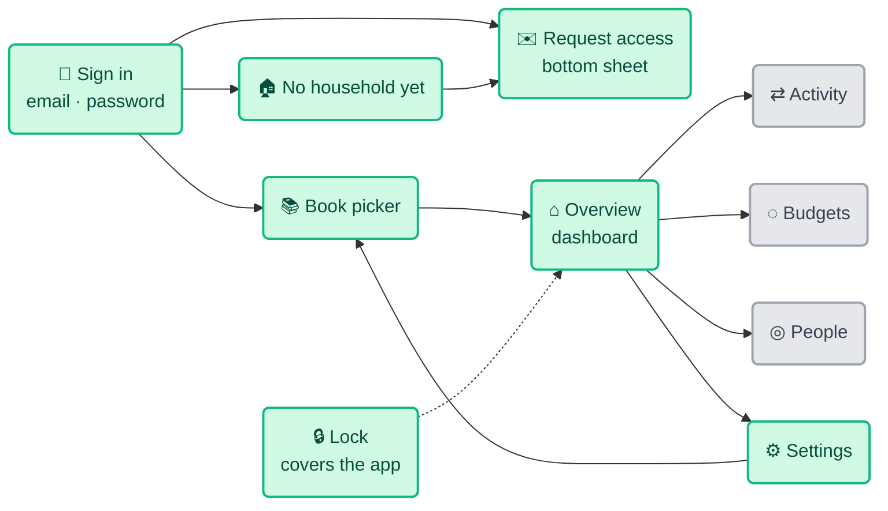
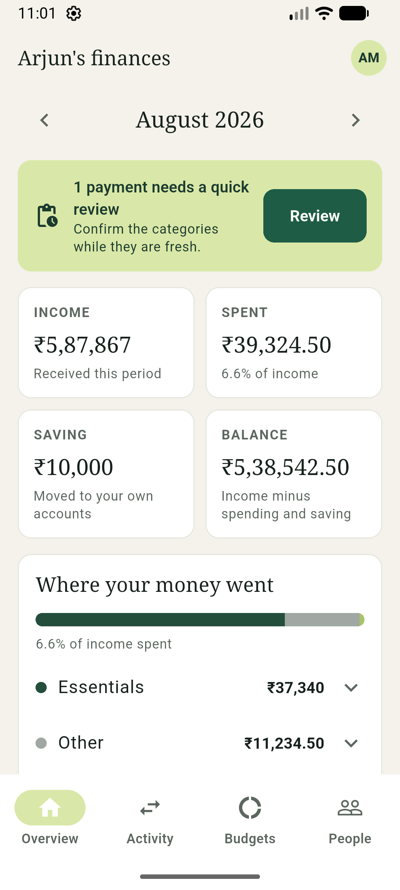
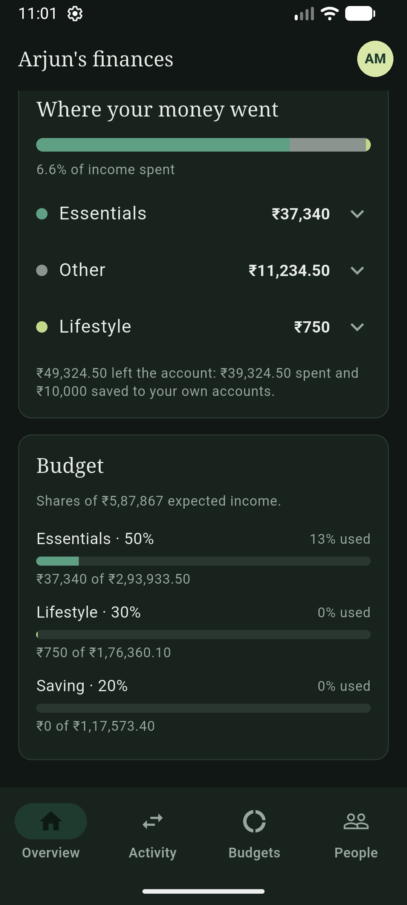
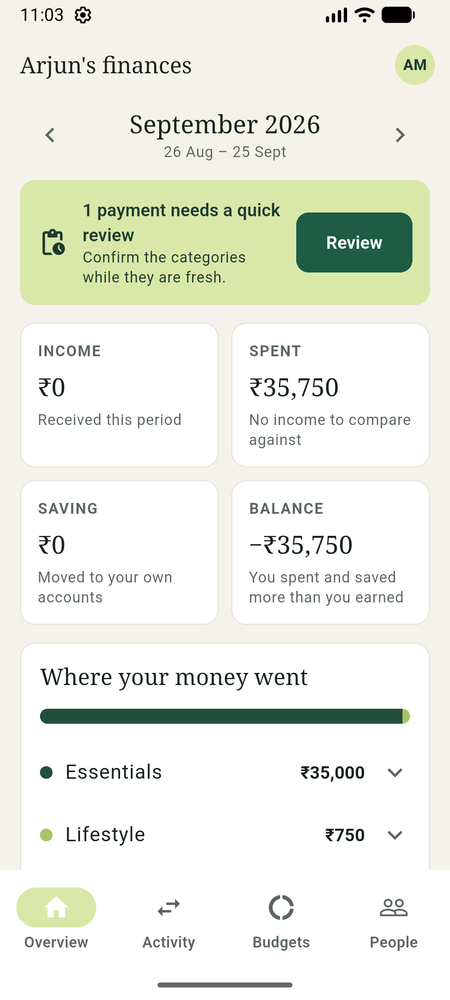
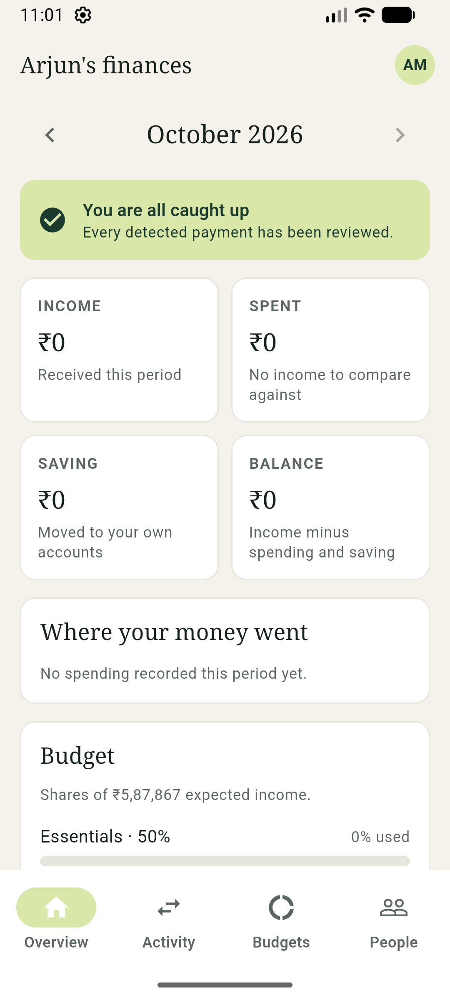
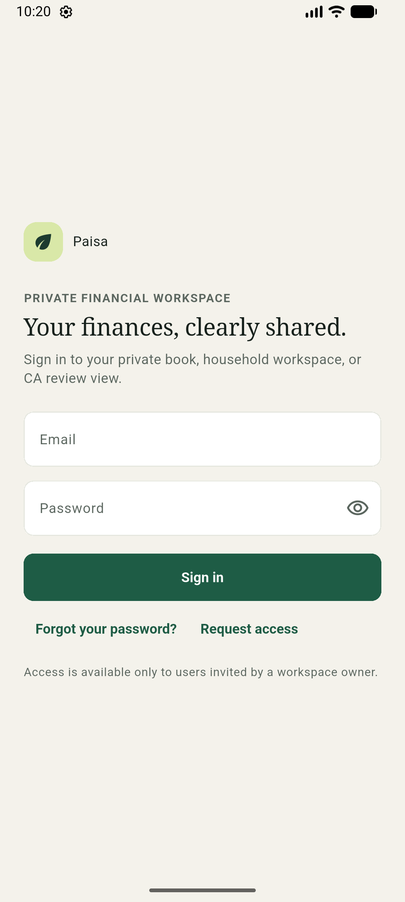
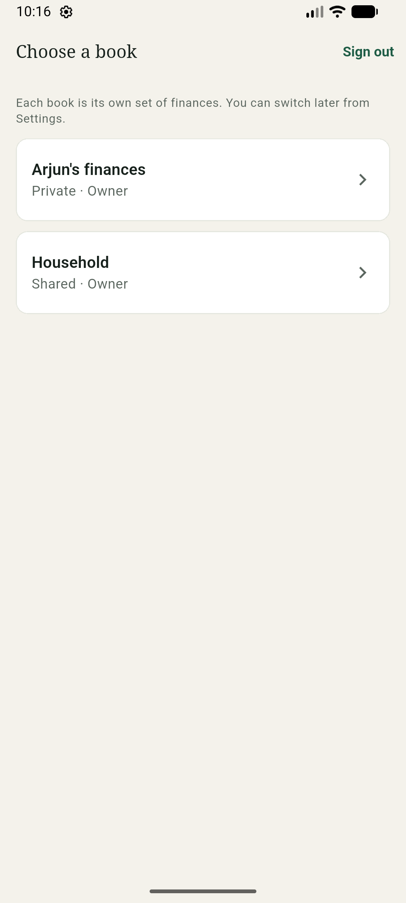
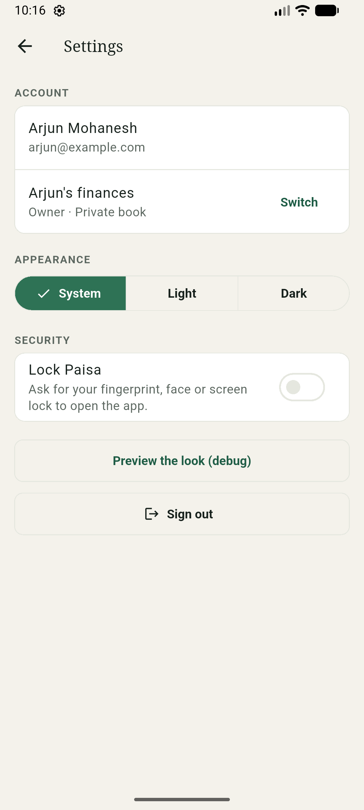
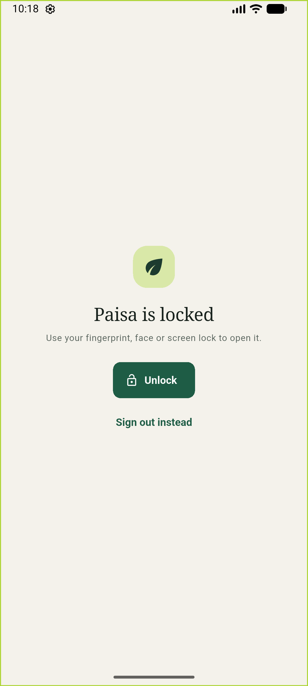

# 🎨 UI/UX Direction

**Paisa Mobile — Android app**

The visual language, layout and writing voice of the phone app. It follows the web
dashboard's [`docs/design.md`](../../docs/design.md); this file records only where
the phone needs something different, and the dark palette, which the web does not
have.

> **Last reviewed** 2026-10-05 · Tokens live in `app/lib/core/theme/tokens.dart` and
> `theme.dart`

---

## 1. The Idea

Same as the web: Paisa is something you open on a Sunday with tea. Deep forest green,
warm paper, a serif for headings. **Calm enough that a number being wrong is the only
thing that stands out.** On a phone that means fewer things per screen, larger text,
and never a screen of zeros that looks like data.

> Nothing is decorative. If an element does not answer a question about money, it
> should not be on the screen.

---

## 2. Colour

Light is the web's palette, with one change (muted text). Dark is new.

| Token | Light | Dark | Used for |
|---|---|---|---|
| `cream` (screen) | `#f4f2eb` | `#101714` | App background |
| `paper` (card) | `#ffffff` | `#19231e` | Cards, sheets, the navigation bar |
| `line` | `#e5e7df` | `#2a3730` | Borders, dividers, empty bars |
| `ink` | `#17211c` | `#e9eee9` | Body text |
| `muted` | `#5b665f` | `#9aa7a0` | Secondary text |
| Primary | `#1e5c45` | `#8ccaa7` | Buttons, links (text on it: white / `#0c1a13`) |
| `positive` | `#2b6a4a` | `#8fd0ac` | Money coming in (`+₹5,87,867`) |
| `lime` | `#d9e8a8` | `#d9e8a8` | The mark, the review card (light) |
| Review card | `#d9e8a8` fill | `#1f3a2e` fill | Container for "N payments need review" |
| `coral` | `#e47d5f` | `#ee9a80` | Overspend bar, attention |
| Error | `#b4472c` | `#f2a28c` | Form errors |

**Category group swatches** keep their order in both modes:

| Group | Light | Dark |
|---|---|---|
| Essentials | `#244e3c` | `#5fa085` |
| Lifestyle | `#a9c467` | `#c3d98a` |
| Saving | `#df8d6d` | `#eba083` |
| Other | `#a1a8a3` | `#8b948f` |
| Income | `#6399a4` | `#7fb4bf` |

- **Red is not the spending colour.** Overspending is a bar passing its limit and
  the words "Over the plan", never a red screen.
- `muted` is darker than the web's `#6e7771`, which reads 4.1:1 on the cream
  background. A phone is used outdoors; the floor here is 4.5:1.
- The light chart swatches (lifestyle, saving, other) are about 2:1 against a white
  card, short of WCAG's 3:1 for graphics. They are the web's brand colours, so they
  stay, and every segment is also named and valued in a legend. See `findings.md` F9.
- `test/theme_test.dart` fails if body, secondary or positive text drops under 4.5:1
  on either background in either mode.

---

## 3. Typography

| Role | Face | Size | Notes |
|---|---|---|---|
| Screen heading | System serif | 24sp / 500 | `-0.3` tracking |
| Card title | System serif | 18sp / 500 | |
| Month name | System serif | 20sp / 500 | |
| Amount in a tile | System serif | 20sp / 500 | Scales down rather than wraps |
| Body | System sans | 14sp | `1.35` line height |
| Secondary, labels | System sans | 12sp | **The floor.** Nothing is smaller |
| Eyebrow | System sans | 12sp / 700 | `0.9` tracking, uppercase |
| Buttons | System sans | 14sp / 700 | |

The web's 10–12px body is a desktop trade-off and unreadable on a handset. Text
scales with the phone's font setting; layouts are tested at 360dp, the narrowest
common width. Two families only, as on the web: the serif is what stops it feeling
like a banking app. Geist is `.woff2` on the web and Flutter needs `.ttf`, so the
phone uses the system faces until someone bundles it (see `findings.md` F12).

---

## 4. Layout

```text
┌──────────────────────────┐
│ Arjun's finances      (AM)│  app bar: the book, the account
├──────────────────────────┤
│  ‹   October 2026   ›     │  month bar (the pay-cycle window sits under it)
│       26 Sept – 25 Oct    │
│ ┌──────────────────────┐ │
│ │ review card          │ │
│ └──────────────────────┘ │
│ ┌────────┐ ┌────────┐    │  two-up tiles, equal height
│ │ INCOME │ │ SPENT  │    │
│ └────────┘ └────────┘    │
│ ┌──────────────────────┐ │
│ │ card (full width)    │ │  16dp margins, 14dp gaps
│ └──────────────────────┘ │
├──────────────────────────┤
│ Overview Activity Budgets People │  bottom navigation, four tabs
└──────────────────────────┘
```

Cards are white (`paper`), 12dp radius, a `line` border and no shadow. Buttons are
10dp radius and at least 48dp tall. The lock covers everything, dialogs and pushed
screens included.

---

## 5. Screen Map



Green is built; grey is a placeholder tab until its phase (3 Activity, 5 Budgets,
6 People).

---

## 6. Components

| Pattern | Rule |
|---|---|
| **Card** | `paper`, 12dp radius, `line` border, no shadow. A serif title, then the content |
| **Stat tile** | Eyebrow label, a big serif number, one honest line beneath. The number shrinks to fit; it never wraps. A negative keeps its `−` |
| **Month bar** | Previous and next arrows (48dp), the month in the serif, the pay-cycle window beneath **only** when the book is not on calendar months. Next stops at today's period |
| **Review card** | `primaryContainer` fill. "N payments need a quick review" with a Review button, or "You are all caught up" with none. Not offered to a viewer |
| **Breakdown** | A 12dp stacked bar (one segment per group, never less than a sliver), "x% of income spent", then a row per group that opens to its categories, then the "₹X left the account" line when money was saved |
| **Budget row** | Group and share on the left, "13% used" on the right, the bar, and the amounts **under** the bar so a long pair wraps on a narrow phone. Amber from 90%, coral over 100%, and always a word |
| **Empty state** | One sentence saying what would appear and why it is empty: "No spending recorded this period yet." Never a row of zeros on its own |
| **Error panel** | An icon, "Cannot reach Paisa" or "Something went wrong", one sentence, a Try again button. It **replaces** the figures; a screen never shows numbers beside an error |
| **Notice** | An inline sentence under a field. Errors in the error colour, confirmations in `muted`. A live region, so a screen reader announces it |
| **Bottom sheet** | One job per sheet, as the web's modal: primary action first. Used for Request access |
| **Lock screen** | The mark, "Paisa is locked", an Unlock button and **Sign out instead**, so a failed sensor never strands someone |
| **Status pill** *(Phase 3)* | Lowercase word with a border. Voided and excluded are struck through |

---

## 7. Writing

The interface talks like a careful colleague, not a brand. Same rules as the web
(§7 there), with the phone's own examples.

| Instead of | Write |
|---|---|
| "Error" | "Cannot reach Paisa. Check your connection. Nothing is shown until Paisa can be reached, so you never see out-of-date figures." |
| "Invalid credentials" | "That email and password combination is not recognised." |
| "No data" | "No spending recorded this period yet." |
| "1 payment need…" | "1 payment needs a quick review" |
| "Success!" | "If who@example.com has an account, a reset link is on its way." (never claim the account exists) |

1. **Never overstate.** A figure that is not the user's balance is not called one.
2. **Say what to do next.** Every error names the fix.
3. **Name the real thing.** "pending review", "voided", "transfer".
4. **Sentence case**, except eyebrows. No exclamation marks.
5. **₹ always.** Indian digit grouping (`₹1,04,178`), paise only when non-zero, a real
   minus sign (`−₹69,142`) never a hyphen.

---

## 8. Feedback

| Signal | Used for |
|---|---|
| Inline notice | Anything you must fix before continuing, under the field |
| Error panel | The ledger could not be loaded: data clears, actions disappear |
| Progress ring | A month loading. The previous month's numbers are never left under the new label |
| Bottom sheet outcome | The reply to a request, in the server's three states |
| System prompt | The phone's own fingerprint or PIN prompt, for the lock |

> When the API is unreachable the app clears the figures and says so. **It never
> shows stale numbers as if they were live** (principle M1).

---

## 9. Accessibility

- Every icon-only control has a tooltip, which is its accessible label: month
  arrows, the settings avatar, the password toggle.
- Status is never colour alone: a budget row says "Over the plan", a role says "Yes"
  or "No", a voided payment will carry its word.
- Touch targets are 48dp. Text scales with the system setting.
- The lock hides the app from screen readers while it is covering it
  (`ExcludeSemantics`), so a locked app does not read out balances.
- Budget rows are read as one sentence: "Lifestyle: ₹750 of ₹1,76,360.10, on track".
- Release builds are marked secure, so screenshots and the recents thumbnail do not
  show balances.

---

## 10. What It Looks Like

| | Light | Dark |
|---|---|---|
| Dashboard |  |  |

| Pay-cycle book, current | Pay-cycle book, one back | Empty period |
|---|---|---|
|  |  |  |

| Sign in | Book picker | Settings | Lock |
|---|---|---|---|
|  |  |  |  |

The Phase 0 look-approval screenshots (`phase0-*.png`) are in the same folder.
