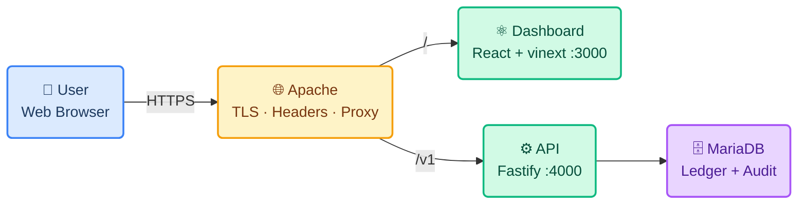

<div align="center">

# 💰 Paisa

**Household finance, built for how money actually moves in India**

UPI · NEFT · ACH · integer paise · Asia-Kolkata · invite-only


</div>

---

Paisa keeps one clear record of what a household earns, spends and sets aside.
It reads bank statements you import, captures payment messages on your own
phone, and sorts them into categories you control.

**It never asks for a banking password, a UPI PIN or a card number, and it
cannot move money.** Accounts are labels on a ledger, nothing more.

> ⚠️ Paisa is a record-keeping tool. It is **not** a bank, and nothing in it is
> financial advice.

---

## 1. What It Does

| | Feature | Detail |
|---|---|---|
| 📄 | **Statement import** | CSV and Excel, read on upload. SBI and HDFC narrations understood. Re-importing is safe — every row is fingerprinted |
| ⚖️ | **Amounts you can trust** | The bank's own running-balance column is used as a checksum. Zero warnings means every amount parsed correctly |
| 🏷️ | **Learns your categories** | Confirm once with "apply to future" and the next payment to the same merchant or VPA files itself |
| 💰 | **Honest money model** | **Spent** = expenses · **Saving** = transfers to your own accounts · **Balance** = income − spent − saving |
| 🎯 | **Budgets as percentages** | 50 / 30 / 20 across category groups, derived from expected income — so a budget works before payday |
| 🔁 | **Recurring plans post themselves** | Month-end sticky: 31 Jan → 28 Feb → **31** Mar, no drift |
| 🔀 | **Account-to-account flows** | See what moved from one of your accounts to another |
| 📒 | **Nothing is quietly rewritten** | Every change is audited with before/after; an imported entry keeps the bank's figure forever |
| 🏠 | **Sealed households** | Separate workspaces. No member of one can read another's books |
| 📱 | **On-device SMS parsing** | Message text never leaves the phone — only amount, date, merchant and reference |

---

## 2. Technology Stack

| Layer | Technology | Purpose |
|---|---|---|
| Frontend | React 19 + vinext (Vite) | Dashboard UI, React Server Components |
| Language | TypeScript (web) · JavaScript ESM (api) | Types where they earn it |
| Styling | Plain CSS with custom properties | One stylesheet, no framework runtime |
| Backend | Fastify | REST API, 40 routes |
| Validation | Zod | Every request boundary |
| ORM | Prisma | Schema, 5 migrations, typed queries |
| Database | MariaDB / MySQL | Ledger, audit trail, tenancy |
| Auth | Firebase Auth + `jose` | Identity; RS256 verified against Google JWKS |
| Mobile | Flutter + Kotlin | Android SMS capture |
| Testing | Vitest | 57 API tests |
| Hosting | DigitalOcean + Apache + systemd | Manual deploy from `main` |

---

## 3. Architecture



The dashboard and the API share one hostname, so the browser never makes a
cross-origin request. Firebase is identity only — it never sees financial data,
and the API needs no service-account key.

---

## 4. Repository

```text
Financial-App/
├── apps/
│   ├── web/       React dashboard — NOT an npm workspace, own lockfile
│   ├── api/       Fastify REST API, Prisma schema, the only test suite
│   ├── worker/    BullMQ stubs — no Redis runs, effectively unused
│   └── mobile/    Flutter Android app + Kotlin SMS bridge
├── deploy/        bootstrap · deploy · migrate · reset-ledger · systemd · Apache
└── docs/          prd · architecture · rules · design · tasks · memory
```

---

## 5. Getting Started

**Requirements** — Node.js **22+** (the API and dashboard both need it), and
MariaDB or MySQL if you want persistence. Flutter 3.38+ and Java 17 only for
Android builds.

```bash
# 1 — install (apps/web has its own lockfile)
npm install
npm --prefix apps/web install

# 2 — database, optional: without DATABASE_URL the API uses a seeded
#     in-memory store, which is enough to run the dashboard and the tests
docker compose up -d
cp .env.example .env
npm run prisma:migrate
npm --workspace @paisa/api run seed

# 3 — run, in two terminals
npm run serve      # API on :4000  (sets AUTH_MODE=dev for you)
npm run dev        # dashboard on :3000
```

> 💡 **No Redis needed.** The worker package is stubs; recurring plans are posted
> by a `setInterval` inside the API itself.

Android:

```bash
cd apps/mobile && flutter pub get
flutter run --dart-define=API_URL=http://10.0.2.2:4000
```

---

## 6. Verification

```bash
npm run test     # 57 API tests (vitest)
npm run lint     # all three JS packages
npm run build    # dashboard build + API/worker syntax check
```

For the dashboard also run `npx tsc --noEmit` inside `apps/web`.

| Endpoint | Purpose |
|---|---|
| `/health` | Liveness |
| `/ready` | Datastore connectivity |
| `/docs` | OpenAPI browser — **not** exposed in production; reach it over an SSH tunnel |

---

## 7. Deployment

| Script | What it does |
|---|---|
| `deploy/bootstrap.sh` | First-time host setup — systemd units, packages, preflight `--check` |
| `deploy/deploy.sh` | Pull, install, generate, clean build, restart, poll health |
| `deploy/migrate.sh` | Verified `mysqldump` backup **before** any schema change |
| `deploy/reset-ledger.sh` | Scoped wipe of one book, backup and typed confirmation first |

```bash
cd /var/www/projects/Financial-App && ./deploy/deploy.sh
```

A release containing a migration needs `./deploy/migrate.sh` first — `deploy.sh`
detects pending migrations and stops rather than running new code against an old
schema. Full walkthroughs: **[VPS deployment](docs/DEPLOY_VPS.md)** ·
**[Production setup](docs/PRODUCTION_SETUP.md)**.

---

## 8. Security

| Control | Detail |
|---|---|
| Credentials | Never requests or stores banking passwords, UPI PINs or card numbers |
| Identity | Firebase ID tokens, RS256, verified against Google's rotating public keys |
| Defaults | `AUTH_MODE` defaults to `firebase`; header-trusting dev mode must be asked for |
| Isolation | Every book route resolves a membership → **404**, so ids cannot be enumerated |
| Provenance | An imported amount is preserved on `TransactionSource` after any edit |
| Exports | Bank-supplied text is neutralised before it reaches a CSV cell |
| Headers | HSTS, CSP, `X-Frame-Options: DENY`, `nosniff` — set at Apache, covering both apps |

A full audit was run on 2026-09-09; every High and Medium finding is fixed. The
remainder are tracked in [docs/tasks.md](docs/tasks.md#7-security-backlog).

> ⚠️ **Do not enforce MFA in Firebase.** The web sign-in cannot complete a
> second-factor challenge yet, and turning it on locks everyone out.

---

## 9. Documentation

| Doc | What's in it |
|---|---|
| 📋 [Product Requirements](docs/prd.md) | The problem, personas, principles, every requirement and its state |
| 🏛️ [System Architecture](docs/architecture.md) | Topology, stack, data model, import pipeline, deployment |
| 📐 [Coding Rules](docs/rules.md) | Conventions, each traced to what breaking it cost |
| 🎨 [UI/UX Direction](docs/design.md) | Tokens, type scale, components, writing voice |
| ✅ [Tasks & Progress](docs/tasks.md) | Phase status, owners, backlog |
| 🧠 [Project Context](docs/memory.md) | Decisions and their reasons, traps already paid for |

---

## 10. Boundaries

Paisa does **not** initiate payments, store banking credentials, calculate or
file tax, lend money, or execute investments. Account Aggregator connectivity is
not implemented.

**Known gaps:** PDF statement import is not built (CSV and Excel are); the
Android app is written but not shipped; refunds are not yet reflected in the
summary tiles. See [docs/tasks.md](docs/tasks.md).

---

<div align="center">
<sub>MIT © 2026 Arjun Mohanesh</sub>
</div>
