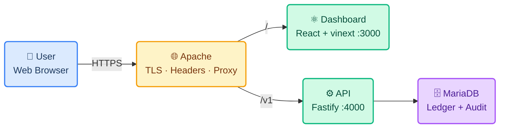
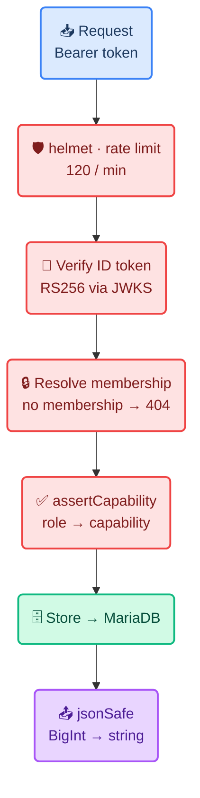
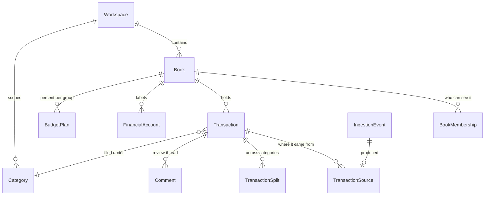
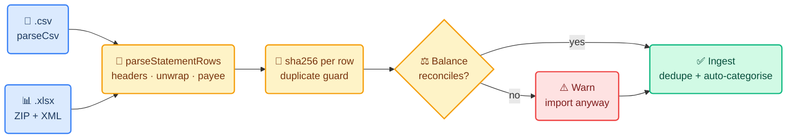

# 🏛️ System Architecture

**Paisa — Household Finance Platform**

This document describes the overall system architecture, technology stack, folder
structure, data flow, and key design decisions for the Paisa application.

> **Last reviewed** 2026-09-20 · **Live** <https://paisa.easylancefreelance.com>

---

## 1. High-Level Architecture

Paisa follows a same-origin architecture: Apache serves the dashboard and proxies
the API under one hostname, so the browser never makes a cross-origin request.



**Android capture** posts to the same `/v1` endpoints. **Firebase** is identity
only — it never sees financial data, and the API verifies its tokens against
Google's public JWKS with no service-account key on the server.

`/docs` (the OpenAPI browser) is deliberately **not** proxied. Reach it over an
SSH tunnel.

---

## 2. Technology Stack

Technologies used in the project and their purpose.

| Layer | Technology | Purpose |
|---|---|---|
| Frontend | React 19 + vinext (Vite) | Dashboard UI, React Server Components |
| Language | TypeScript (web) · JavaScript ESM (api) | Types where they earn it |
| Styling | Plain CSS with custom properties | One stylesheet, no framework runtime |
| Backend | Fastify | REST API, 40 routes |
| Validation | Zod | Every request boundary |
| ORM | Prisma | Schema, migrations, typed queries |
| Database | MariaDB | Ledger, audit trail, tenancy |
| Auth | Firebase Auth + `jose` | Identity; RS256 verified against JWKS |
| Mobile | Flutter + Kotlin | Android SMS capture |
| Testing | Vitest | 57 API tests |
| Hosting | DigitalOcean droplet + Apache | Shared with two other sites |
| Process | systemd | `paisa-api`, `paisa-web` |

---

## 3. Folder Structure

The project uses a monorepo with one app per concern.

```text
Financial-App/
├── apps/
│   ├── web/              React dashboard — NOT an npm workspace, own lockfile
│   │   └── app/
│   │       ├── page.tsx          the entire dashboard, dense single-file style
│   │       ├── [slug]/           13 public information pages
│   │       ├── site-pages.ts     their content
│   │       └── globals.css       design tokens + every component style
│   ├── api/              Fastify REST API
│   │   ├── src/
│   │   │   ├── app.js            routes, validation, capability checks
│   │   │   ├── plugins/auth.js   Firebase tokens, App Check, provisioning
│   │   │   ├── domain/           ← shared rules, see §5
│   │   │   └── store/            memory-store.js + prisma-store.js
│   │   ├── prisma/               schema, 5 migrations, seed
│   │   └── test/api.test.js      the only test suite
│   ├── worker/           BullMQ stubs — no Redis runs, effectively dead
│   └── mobile/           Flutter + Kotlin SMS bridge — written, not shipped
├── deploy/               bootstrap · deploy · migrate · reset-ledger · systemd · Apache
└── docs/                 prd · architecture · rules · design · tasks · memory
```

---

## 4. Request Lifecycle

Every request to `/v1` passes the same gauntlet before touching data.



> **404, not 403.** A book you are not a member of returns *not found*, so book
> ids cannot be enumerated by probing.

---

## 5. The Domain Layer

Two stores implement one interface: `memory-store.js` (tests, demo mode) and
`prisma-store.js` (MariaDB). **They diverged silently once.** Anything both must
agree on now lives in `src/domain/`.

| Module | Owns |
|---|---|
| `money.js` | Paise parsing, BigInt-safe JSON |
| `statement.js` | Column detection, narration parsing, row fingerprints |
| `xlsx.js` | Dependency-free ZIP + XML sheet reader |
| `categorization.js` | Which rule claims a payment |
| `spending.js` | Category breakdown, incl. uncategorized and transfers |
| `accounts.js` | Per-account in/out/net and account-to-account flows |
| `recurring.js` | Cadence maths, month-end stickiness, expected income |
| `permissions.js` | Role → capability |
| `period.js` | Month boundaries in the book's timezone |
| `default-categories.js` | The starter list — seed, memory store, provisioning |

---

## 6. Data Model

21 models, 7 enums. The spine of the ledger:



| Concept | Model | The point |
|---|---|---|
| **Household** | `Workspace` | The tenancy boundary. Nothing crosses it |
| **Book** | `Book` | One set of finances — private or shared |
| **Money** | `Transaction.amountMinor` | `BigInt` paise. Never a float |
| **Provenance** | `TransactionSource.importedAmount` | What the bank said, kept after any edit |
| **Idempotency** | `IngestionEvent.sourceHash` | Unique per workspace — the duplicate guard |
| **History** | `AuditEvent` | Append-only, `before` / `after` JSON |

**Migrations** (all checked in):
`initial` → `book_invitations` → `idempotency_records` → `budget_plan` → `transfer_destination`

---

## 7. Statement Import Pipeline

Two readers, one pipeline. Verified on real exports: **SBI 17 rows** and
**HDFC 172 rows**, both with zero warnings.



**The bank's own running-balance column is the checksum.** Zero warnings on a
real file means every amount was read correctly — the strongest signal
available, and free.

---

## 8. Authentication & Tenancy

| Control | Mechanism |
|---|---|
| Identity | Firebase ID token, RS256, verified against Google JWKS |
| Mode | `AUTH_MODE` defaults to **`firebase`**; `dev` must be asked for explicitly |
| App Check | Optional, defaults to **enforce** when configured |
| Isolation | Every book route resolves a `BookMembership` → **404** without one |
| New tenants | `TENANT_SELF_PROVISION` (off) creates a workspace on first sign-in |

Capabilities are strictly nested:

```text
viewer       read
reviewer     + comment · export · split · verify · reclassify
editor       + create · edit
book_owner   + manage_book · delete_manual
admin        + manage_members
```

---

## 9. Scheduling

No Redis, no cron. The API runs **one `setInterval`** (`RECURRING_POLL_MS`,
default 15 minutes) that posts due recurring plans, plus one run at boot to catch
up after downtime.

Postings are keyed `recurring:<planId>:<dueDate>`, so an overlapping tick or a
restart mid-run cannot post the same month twice. One process under systemd is
all the scheduling this needs.

---

## 10. Deployment

| Piece | Detail |
|---|---|
| Host | DigitalOcean droplet, **shared** with a Laravel app and a React site |
| Path | `/var/www/projects/Financial-App` |
| Services | `paisa-api.service`, `paisa-web.service` (`Restart=always`) |
| Web | `vinext start` ignores `HOST`, binds `0.0.0.0`; `PORT` set inside `ExecStart` |
| API | Honours `HOST=127.0.0.1` — never exposed directly |
| Deploy | `./deploy/deploy.sh` — pull, install, generate, clean build, restart, poll |
| Schema | `./deploy/migrate.sh` — verified `mysqldump` backup **before** any change |
| Reset | `./deploy/reset-ledger.sh <bookId>` — scoped wipe: transactions, ingestion events, imports and period reviews. Backup and typed confirmation first |
| Reset rules | `./deploy/reset-rules.sh <bookId>` — pick which categorization rules to drop. Book-scoped, restore file written first |
| Shared | `deploy/lib-db.sh` — one copy of the `DATABASE_URL` parsing and the 0600 credentials file, sourced by the three scripts that need a database |

> The build **fails loudly** if the Firebase config is missing from the bundle.
> A stale `dist` once shipped an unauthenticated dashboard while reporting
> success.
