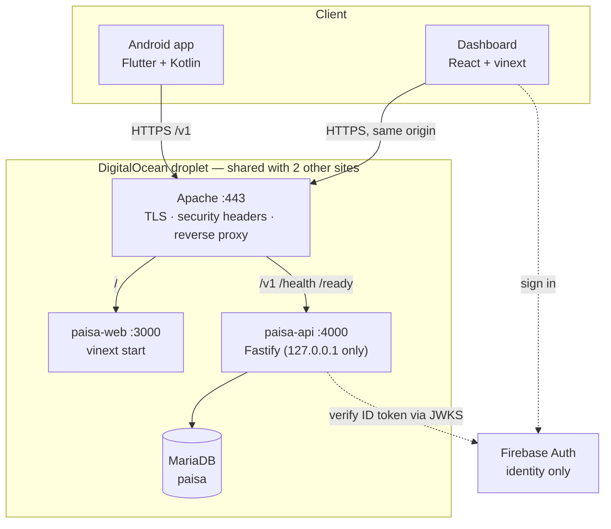
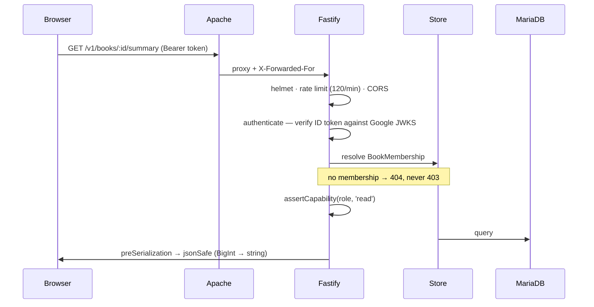
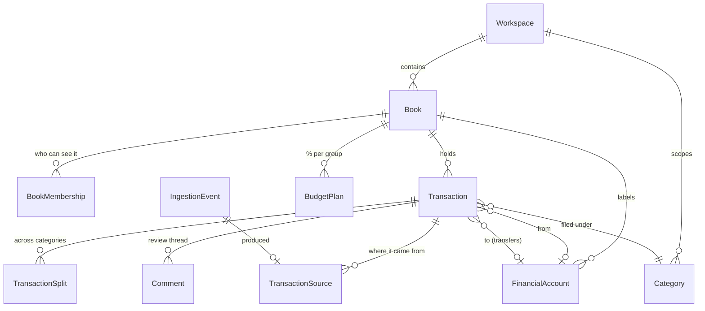
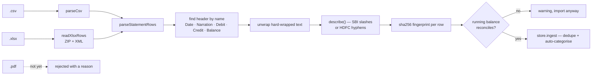

# Paisa — Architecture

> **Shape** monorepo · 4 apps · one MariaDB · one droplet
> **Last reviewed** 2026-09-20

---

## 1. The whole thing at a glance



**One origin for both.** Apache serves the dashboard at `/` and proxies
`/v1`, `/health`, `/ready` to the API. The browser never makes a cross-origin
request, so there is no CORS to misconfigure. `/docs` is deliberately *not*
proxied — reach the OpenAPI browser over an SSH tunnel.

## 2. Apps

| Path | What | Stack | Notes |
|---|---|---|---|
| `apps/web` | Dashboard | React 19, vinext (Vite), TypeScript | **Not** an npm workspace — own lockfile |
| `apps/api` | REST API | Fastify, Prisma, Zod, jose | 40 routes, the only tested package |
| `apps/worker` | Background jobs | BullMQ, ioredis | **Stubs.** No Redis runs; effectively dead |
| `apps/mobile` | Android capture | Flutter + Kotlin | Written, never shipped |
| `deploy/` | Operations | bash, systemd, Apache | bootstrap · deploy · migrate · reset-ledger |

Only `apps/api` has tests: **57 passing**, in one file, `test/api.test.js`.

## 3. The API

### 3.1 Request lifecycle



### 3.2 Layers

| Layer | File(s) | Responsibility |
|---|---|---|
| Routes | `src/app.js` | Zod validation, capability checks, HTTP shape |
| Auth | `src/plugins/auth.js` | Firebase ID token, App Check, tenant provisioning |
| **Domain** | `src/domain/*.js` | Every rule both stores must agree on |
| Stores | `src/store/{memory,prisma}-store.js` | Persistence, two implementations of one interface |

**The domain layer exists because the two stores silently diverged once.**
Anything they must agree on lives here:

| Module | Owns |
|---|---|
| `money.js` | paise parsing, BigInt-safe JSON |
| `statement.js` | column detection, narration parsing, row fingerprints |
| `xlsx.js` | dependency-free ZIP + XML sheet reader |
| `categorization.js` | which rule claims a payment |
| `spending.js` | the category breakdown, incl. uncategorized and transfers |
| `accounts.js` | per-account in/out/net and account-to-account flows |
| `recurring.js` | cadence maths, month-end stickiness, expected income |
| `permissions.js` | role → capability |
| `period.js` | month boundaries in the book's timezone |
| `default-categories.js` | the starter list, shared by seed / memory / provisioning |

### 3.3 Routes — 40 total

| Group | Verbs | Path |
|---|---|---|
| Identity | `GET` `PATCH` | `/me`, `GET /workspaces`, `GET /books` |
| Ledger | `GET` `POST` `PATCH` | `/books/:id/transactions[/:txId]` |
| Ledger detail | `PATCH` `PUT` `POST` | `.../category`, `.../splits`, `.../comments` |
| Capture | `POST` | `/books/:id/ingestion-events`, `/books/:id/imports` |
| Money model | `GET` `PUT` | `/summary`, `/budget-plan`, `/budgets/:categoryId` |
| Config | full CRUD | `/accounts`, `/categories`, `/categorization-rules`, `/recurring-plans` |
| People | `GET` `POST` `PATCH` `DELETE` | `/memberships`, `/invitations`, `POST /invitations/accept` |
| Audit | `GET` `POST` | `/audit-events`, `/period-reviews` |

## 4. Data model

21 models, 7 enums. The spine:



| Concept | Model | The point |
|---|---|---|
| **Household** | `Workspace` | The tenancy boundary. Nothing crosses it |
| **Book** | `Book` | One set of finances — private or shared |
| **Money** | `Transaction.amountMinor` | `BigInt` paise. Never a float |
| **Provenance** | `TransactionSource.importedAmount` | What the bank said, kept after any edit |
| **Idempotency** | `IngestionEvent.sourceHash` | Unique per workspace — the duplicate guard |
| **History** | `AuditEvent` | Append-only, `before` / `after` JSON |

**Five migrations**, all checked in:
`initial` → `book_invitations` → `idempotency_records` → `budget_plan` → `transfer_destination`.

## 5. Statement import



Two readers, one pipeline. Verified on real exports: **SBI 17 rows, HDFC 172
rows, zero warnings** — the bank's own balance column is the checksum.

## 6. Authentication & tenancy

| Control | Mechanism |
|---|---|
| Identity | Firebase ID token, RS256, verified against Google JWKS. No service-account key |
| Mode | `AUTH_MODE` defaults to **`firebase`**; `dev` must be asked for explicitly |
| App Check | Optional, defaults to **enforce** when configured |
| Isolation | Every book route resolves a `BookMembership` → **404** without one |
| Capability | `viewer` ⊂ `reviewer` ⊂ `editor` ⊂ `book_owner` ⊂ `workspace_admin` |
| New tenants | `TENANT_SELF_PROVISION` (off) creates a workspace on first sign-in |

```
viewer      read
reviewer    + comment · export · split · verify · reclassify
editor      + create · edit
book_owner  + manage_book · delete_manual
admin       + manage_members
```

## 7. Scheduling

No Redis, no cron. The API runs **one `setInterval`** (`RECURRING_POLL_MS`,
default 15 min) that posts due recurring plans, plus one run at boot to catch
up. Postings are keyed `recurring:<planId>:<dueDate>`, so an overlapping tick or
a restart mid-run cannot post the same month twice. One process under systemd is
all the scheduling this needs.

## 8. Deployment

| Piece | Detail |
|---|---|
| Host | DigitalOcean droplet, **shared** with a Laravel app and a React site |
| Path | `/var/www/projects/Financial-App` |
| Services | `paisa-api.service`, `paisa-web.service` (systemd, `Restart=always`) |
| Web | `vinext start` — ignores `HOST`, binds `0.0.0.0`; `PORT` set inside `ExecStart` |
| API | Honours `HOST=127.0.0.1` — never exposed directly |
| Deploy | `./deploy/deploy.sh` — pull, install, prisma generate, clean build, restart, poll health |
| Schema | `./deploy/migrate.sh` — verified `mysqldump` backup **before** any change |
| Reset | `./deploy/reset-ledger.sh <bookId>` — scoped wipe, backup, typed confirmation |

The build **fails loudly** if the Firebase config is missing from the bundle,
because a stale `dist` once shipped an unauthenticated dashboard while reporting
success.
