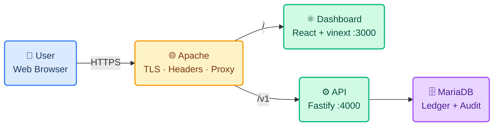
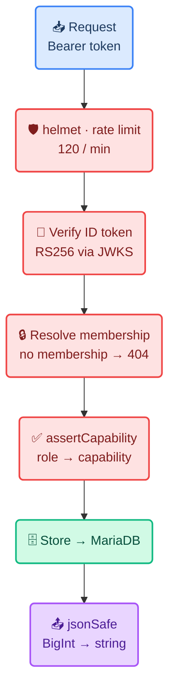
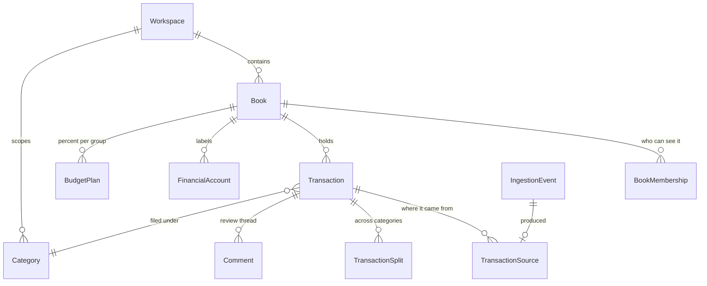
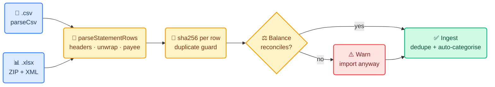

# 🏛️ System Architecture

**Paisa — Household Finance Platform**

This document describes the overall system architecture, technology stack, folder
structure, data flow, and key design decisions for the Paisa application.

> **Last reviewed** 2026-10-03 · **Live** <https://paisa.easylancefreelance.com>

---

## 1. High-Level Architecture

Paisa follows a same-origin architecture: Apache serves the dashboard and proxies
the API under one hostname, so the browser never makes a cross-origin request.


```mermaid
flowchart LR
    U("👤 User<br/>Web Browser")
    A("🌐 Apache<br/>TLS · Headers · Proxy")
    W("⚛️ Dashboard<br/>React + vinext :3000")
    S("⚙️ API<br/>Fastify :4000")
    D("🗄️ MariaDB<br/>Ledger + Audit")

    U -->|HTTPS| A
    A -->|"/"| W
    A -->|"/v1"| S
    S --> D

    classDef user fill:#dbeafe,stroke:#3b82f6,stroke-width:2px,color:#1e3a5f
    classDef edge fill:#fef3c7,stroke:#f59e0b,stroke-width:2px,color:#78350f
    classDef app  fill:#d1fae5,stroke:#10b981,stroke-width:2px,color:#064e3b
    classDef data fill:#e9d5ff,stroke:#a855f7,stroke-width:2px,color:#4c1d95

    class U user
    class A edge
    class W,S app
    class D data
```

**Android capture** posts to the same `/v1` endpoints. **Firebase** is identity
only — it never sees financial data, and the API verifies its tokens against
Google's public JWKS with no service-account key on the server.

`/docs` (the OpenAPI browser) is deliberately **not** proxied. Reach it over an
SSH tunnel.

---

## 2. Technology Stack

Technologies used in the project and their purpose.

| Layer | Technology | Purpose |
|---|---|---|
| Frontend | React 19 + vinext (Vite) | Dashboard UI, React Server Components |
| Language | TypeScript (web) · JavaScript ESM (api) | Types where they earn it |
| Styling | Plain CSS with custom properties | One stylesheet, no framework runtime |
| Backend | Fastify | REST API, 48 routes |
| Validation | Zod | Every request boundary |
| ORM | Prisma | Schema, migrations, typed queries |
| Database | MariaDB | Ledger, audit trail, tenancy |
| Auth | Firebase Auth + `jose` | Identity; RS256 verified against JWKS |
| Mobile | Flutter + Kotlin | Android SMS capture |
| Testing | Vitest | 68 API tests |
| Hosting | DigitalOcean droplet + Apache | Shared with two other sites |
| Process | systemd | `paisa-api`, `paisa-web` |

---

## 3. Folder Structure

The project uses a monorepo with one app per concern.

```text
Financial-App/
├── apps/
│   ├── web/              React dashboard — NOT an npm workspace, own lockfile
│   │   └── app/
│   │       ├── page.tsx          the entire dashboard, dense single-file style
│   │       │                      — renders the landing page when signed out
│   │       ├── landing.tsx       the public landing page + dashboard preview
│   │       ├── admin/            master admin console — its own route and chrome
│   │       ├── api-client.ts     one fetch wrapper, shared by both consoles
│   │       ├── login/            the sign-in route
│   │       ├── sign-in.tsx       the sign-in card, shared by "/" and /login
│   │       ├── site-chrome.tsx   header + footer for every public page
│   │       ├── [slug]/           13 public information pages
│   │       ├── site-pages.ts     their content
│   │       ├── landing.css       public-page styles — also reaches the dashboard
│   │       │                      bundle, since page.tsx imports Landing
│   │       └── globals.css       design tokens + every dashboard style
│   ├── api/              Fastify REST API
│   │   ├── src/
│   │   │   ├── app.js            routes, validation, capability checks
│   │   │   ├── plugins/auth.js   Firebase tokens, App Check, provisioning
│   │   │   ├── domain/           ← shared rules, see §5
│   │   │   └── store/            memory-store.js + prisma-store.js
│   │   ├── prisma/               schema, 6 migrations, seed
│   │   └── test/api.test.js      the only test suite
│   ├── worker/           BullMQ stubs — no Redis runs, effectively dead
│   └── mobile/           Flutter + Kotlin SMS bridge — written, not shipped
├── deploy/               bootstrap · deploy · migrate · reset-ledger · reset-rules
│                         lib-db.sh + lib-db.test.sh · systemd · Apache
└── docs/                 prd · architecture · rules · design · tasks · memory
```

---

## 4. Request Lifecycle

Every request to `/v1` passes the same gauntlet before touching data.


```mermaid
flowchart TD
    R("📥 Request<br/>Bearer token")
    H("🛡️ helmet · rate limit<br/>120 / min")
    T("🔑 Verify ID token<br/>RS256 via JWKS")
    M("🔒 Resolve membership<br/>no membership → 404")
    C("✅ assertCapability<br/>role → capability")
    Q("🗄️ Store → MariaDB")
    J("📤 jsonSafe<br/>BigInt → string")

    R --> H --> T --> M --> C --> Q --> J

    classDef entry fill:#dbeafe,stroke:#3b82f6,stroke-width:2px,color:#1e3a5f
    classDef guard fill:#fee2e2,stroke:#ef4444,stroke-width:2px,color:#7f1d1d
    classDef work  fill:#d1fae5,stroke:#10b981,stroke-width:2px,color:#064e3b
    classDef out   fill:#e9d5ff,stroke:#a855f7,stroke-width:2px,color:#4c1d95

    class R entry
    class H,T,M,C guard
    class Q work
    class J out
```

> **404, not 403.** A book you are not a member of returns *not found*, so book
> ids cannot be enumerated by probing.

---

## 5. The Domain Layer

Two stores implement one interface: `memory-store.js` (tests, demo mode) and
`prisma-store.js` (MariaDB). **They diverged silently once.** Anything both must
agree on now lives in `src/domain/`.

| Module | Owns |
|---|---|
| `money.js` | Paise parsing, BigInt-safe JSON |
| `statement.js` | Column detection, narration parsing, row fingerprints |
| `xlsx.js` | Dependency-free ZIP + XML sheet reader |
| `categorization.js` | Which rule claims a payment |
| `spending.js` | Category breakdown, incl. uncategorized and transfers |
| `accounts.js` | Per-account in/out/net and account-to-account flows |
| `recurring.js` | Cadence maths, month-end stickiness, expected income |
| `permissions.js` | Role → capability |
| `period.js` | Month boundaries in the book's timezone |
| `default-categories.js` | The starter list — seed, memory store, provisioning |

---

## 6. Data Model

21 models, 7 enums. The spine of the ledger:


```mermaid
erDiagram
    Workspace ||--o{ Book : contains
    Workspace ||--o{ Category : scopes
    Book ||--o{ BookMembership : "who can see it"
    Book ||--o{ Transaction : holds
    Book ||--o{ FinancialAccount : labels
    Book ||--o{ BudgetPlan : "percent per group"
    Transaction ||--o{ TransactionSource : "where it came from"
    Transaction ||--o{ TransactionSplit : "across categories"
    Transaction ||--o{ Comment : "review thread"
    Transaction }o--|| Category : "filed under"
    IngestionEvent ||--o| TransactionSource : produced
```

| Concept | Model | The point |
|---|---|---|
| **Household** | `Workspace` | The tenancy boundary. Nothing crosses it |
| **Book** | `Book` | One set of finances — private or shared |
| **Money** | `Transaction.amountMinor` | `BigInt` paise. Never a float |
| **Provenance** | `TransactionSource.importedAmount` | What the bank said, kept after any edit |
| **Idempotency** | `IngestionEvent.sourceHash` | Unique per workspace — the duplicate guard |
| **History** | `AuditEvent` | Append-only, `before` / `after` JSON |
| **Waiting list** | `AccessRequest` | Name and email of somebody with no account yet. Unique email; `approvedAt` is the tick |

**Migrations** (all checked in):
`initial` → `book_invitations` → `idempotency_records` → `budget_plan` →
`transfer_destination` → `period_start_day` → `access_requests`

---

## 7. Statement Import Pipeline

Two readers, one pipeline. Verified on real exports: **SBI 17 rows** and
**HDFC 172 rows**, both with zero warnings.


```mermaid
flowchart LR
    C("📄 .csv<br/>parseCsv")
    X("📊 .xlsx<br/>ZIP + XML")
    P("🔀 parseStatementRows<br/>headers · unwrap · payee")
    F("🔐 sha256 per row<br/>duplicate guard")
    B{"⚖️ Balance<br/>reconciles?"}
    I("✅ Ingest<br/>dedupe + auto-categorise")
    W("⚠️ Warn<br/>import anyway")

    C --> P
    X --> P
    P --> F --> B
    B -->|yes| I
    B -->|no| W --> I

    classDef input fill:#dbeafe,stroke:#3b82f6,stroke-width:2px,color:#1e3a5f
    classDef proc  fill:#fef3c7,stroke:#f59e0b,stroke-width:2px,color:#78350f
    classDef good  fill:#d1fae5,stroke:#10b981,stroke-width:2px,color:#064e3b
    classDef warn  fill:#fee2e2,stroke:#ef4444,stroke-width:2px,color:#7f1d1d

    class C,X input
    class P,F,B proc
    class I good
    class W warn
```

**The bank's own running-balance column is the checksum.** Zero warnings on a
real file means every amount was read correctly — the strongest signal
available, and free.

---

## 8. Authentication & Tenancy

| Control | Mechanism |
|---|---|
| Identity | Firebase ID token, RS256, verified against Google JWKS |
| Mode | `AUTH_MODE` defaults to **`firebase`**; `dev` must be asked for explicitly |
| App Check | Optional, defaults to **enforce** when configured |
| Isolation | Every book route resolves a `BookMembership` → **404** without one |
| New tenants | `TENANT_SELF_PROVISION` (off) creates a workspace on first sign-in |
| Master admin | `PLATFORM_ADMINS`, a list of emails in the server's environment |

Capabilities are strictly nested:

```text
viewer       read
reviewer     + comment · export · split · verify · reclassify
editor       + create · edit
book_owner   + manage_book · delete_manual
admin        + manage_members
```

### 8.1 Master Admin

A separate console at `/admin`, backed by `/v1/admin/*`. It is the one role that
is **not** stored in the database: `PLATFORM_ADMINS` is an environment variable,
so granting it needs shell access to the host and a restart, not a row.

| | |
|---|---|
| **Gate** | Not listed → every `/v1/admin` route **404s**, the same convention the book routes use |
| **No household needed** | A master admin with no `UserProfile` authenticates with a profile-less actor. It grants no ledger access — book routes still resolve a membership |
| **Firebase half** | `domain/firebase-admin.js` — list, create, rename, disable, delete, send a reset. Needs a service-account key |
| **Ledger half** | `exportUserData`, `wipeUserLedger`, `deletePlatformUser`. Needs nothing extra |
| **Degrades** | No key → the page lists only accounts that have signed in, and says so. It never fails closed on the half that works |
| **Record** | Admin actions go to the journal, because the workspace an audit row would live in is sometimes the thing being deleted |

Scope is the important part:

- An **export** covers every book the user is a member of — exactly what they can
  already read, never more.
- A **ledger wipe** touches only books they **own**, so clearing out a CA cannot
  empty the household they review.
- A **delete** removes the profile and any book nobody else is a member of.
  Shared books survive.
- A **factory reset** clears the ledger *and* the configuration learned on top
  of it — accounts, rules, budgets, the percentage plan, recurring plans,
  pending invitations, the audit trail — then re-seeds `DEFAULT_CATEGORIES`,
  because a book with no categories cannot file anything. The login, the books
  and the memberships survive.

Categories are **workspace-scoped**, so a factory reset only removes the ones
nothing outside the reset books still references. `TransactionSplit.category` is
`Restrict`: a split in a book the reset does not own would abort the whole
transaction. `RecurringPlan.category` is `SetNull`, which would silently
un-categorise someone else's plan, so it is counted as a reference too.

No password is ever handled: a new account is created without one and sent a
reset link, and a reset is emailed by Firebase rather than returned as a link.

#### Access requests

`POST /v1/access-requests` is the **only unauthenticated write on the API** —
the "Request access" popup on the landing page, which is the one way in from
outside an invite-only app. It stores a name and an email, nothing else, and is
rate-limited to **5 per 10 minutes per IP** rather than the global 120 a minute.

The reply tells the sender which of three situations they are in, because being
told to wait when you have already been let in sends you back a third time:

| Reply | Means |
|---|---|
| `received` | Filed. The admin can see it |
| `pending` | Already asked, still waiting. The unique email means a second submission cannot become a second row |
| `granted` | Already approved — go and sign in |

Approving is one act, not two: `POST /v1/admin/access-requests/:id/approve`
creates the Firebase account (reusing one that already exists, so it is safe to
click twice), sends the link that lets them choose their own password,
provisions a household, and stamps `approvedAt`. **Adding a user outright goes
through the same function**, so somebody the admin created without a request is
still told "access granted" rather than "wait your turn" if they later fill in
the form. Deleting a user drops their row, so they can ask again.

---

## 9. Scheduling

No Redis, no cron. The API runs **one `setInterval`** (`RECURRING_POLL_MS`,
default 15 minutes) that posts due recurring plans, plus one run at boot to catch
up after downtime.

Postings are keyed `recurring:<planId>:<dueDate>`, so an overlapping tick or a
restart mid-run cannot post the same month twice. One process under systemd is
all the scheduling this needs.

---

## 10. Deployment

| Piece | Detail |
|---|---|
| Host | DigitalOcean droplet, **shared** with a Laravel app and a React site |
| Path | `/var/www/projects/Financial-App` |
| Services | `paisa-api.service`, `paisa-web.service` (`Restart=always`) |
| Web | `vinext start` ignores `HOST`, binds `0.0.0.0`; `PORT` set inside `ExecStart` |
| API | Honours `HOST=127.0.0.1` — never exposed directly |
| Deploy | `./deploy/deploy.sh` — pull, install, generate, clean build, restart, poll |
| Schema | `./deploy/migrate.sh` — verified `mysqldump` backup **before** any change |
| Reset | `./deploy/reset-ledger.sh <bookId>` — scoped wipe: transactions, ingestion events, imports and period reviews. Backup and typed confirmation first |
| Reset rules | `./deploy/reset-rules.sh <bookId>` — pick which categorization rules to drop. Book-scoped, restore file written first |
| Shared | `deploy/lib-db.sh` — one copy of the `DATABASE_URL` parsing and the 0600 credentials file, sourced by the three scripts that need a database |

> The build **fails loudly** if the Firebase config is missing from the bundle.
> A stale `dist` once shipped an unauthenticated dashboard while reporting
> success.
