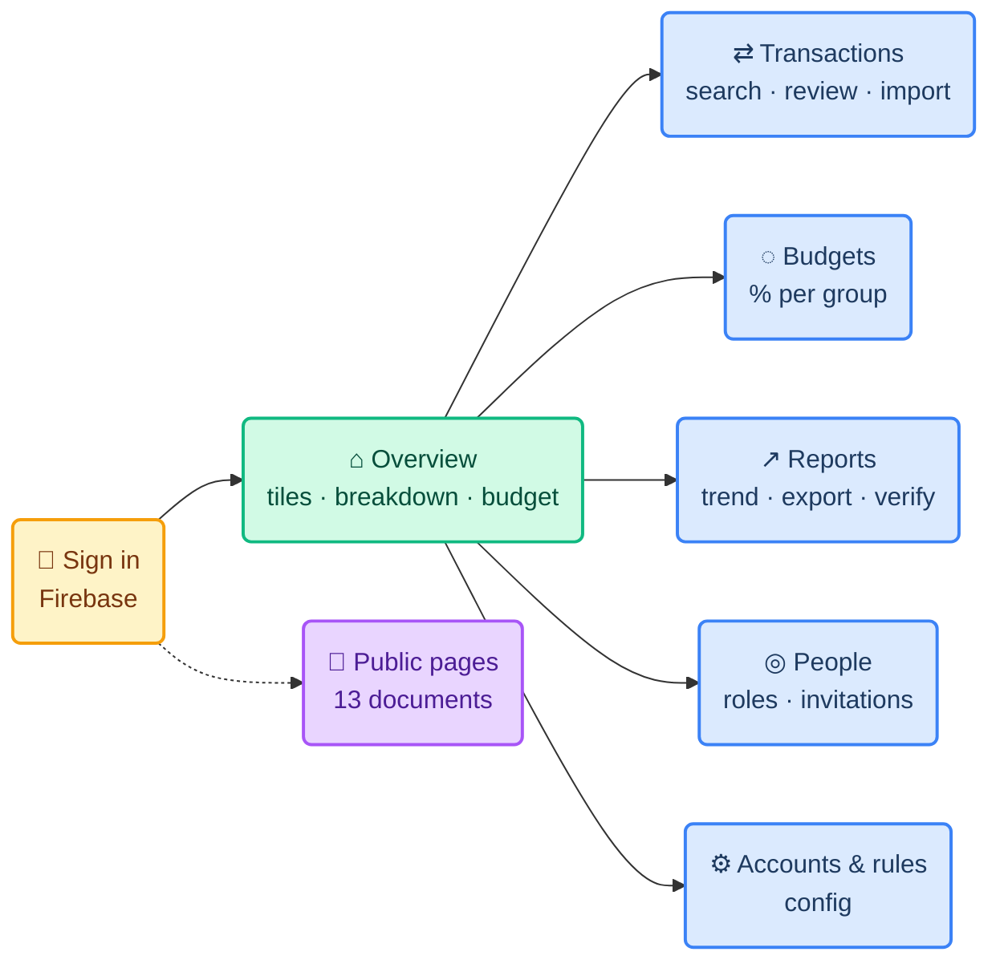

# 🎨 UI/UX Direction

**Paisa — Household Finance Platform**

This document defines the visual language, layout system, component patterns and
writing voice of the dashboard.

> **Last reviewed** 2026-09-20 · Tokens live in `apps/web/app/globals.css`

---

## 1. The Idea

Money apps default to alarm: red arrows, urgent gradients, a dopamine chart.
Paisa is something you open on a Sunday with tea. Deep forest green, warm paper,
a serif for headings. Calm enough that **a number being wrong is the only thing
that stands out.**

> Nothing is decorative. If an element does not answer a question about money, it
> should not be on the page.

---

## 2. Colour

| Token | Value | Used for |
|---|---|---|
| `--ink` | `#17211c` | Body text |
| `--muted` | `#6e7771` | Secondary text |
| `--green` | `#1e5c45` | Primary actions |
| `--green-2` | `#2e7255` | Hover, accents |
| `--cream` | `#f4f2eb` | App background |
| `--paper` | `#ffffff` | Cards |
| `--line` | `#e5e7df` | Borders, dividers |
| `--lime` | `#d9e8a8` | Positive highlight |
| `--coral` | `#e47d5f` | Spending, attention |
| `--shadow` | `0 8px 28px rgb(25 48 37 / 6%)` | Card lift |

The sidebar is `#153e31` — darker than any token, so navigation recedes and
content comes forward.

**Category group swatches**, in spend order:

| Group | Swatch |
|---|---|
| Essentials | `#244e3c` |
| Lifestyle | `#a9c467` |
| Saving | `#df8d6d` |
| Other | `#a1a8a3` |
| Income | `#6399a4` |

> **Red is not the spending colour.** Coral says "look here". Overspending is
> shown by a bar passing its limit, not by turning the page red.

---

## 3. Typography

| Role | Family | Size | Notes |
|---|---|---|---|
| `h1` | Georgia, serif | 26px / 500 | `-0.55px` tracking — the editorial note |
| `h2` | Georgia, serif | 15–17px | Card titles |
| `.eyebrow` | Geist | 9px / 760 | `0.1em` tracking, uppercase — labels a region |
| Body | Geist | 10–12px | Dense by design |
| Amounts | Geist | 10–13px / 650 | `₹` always present |

Two families only: **Georgia** for anything read as a sentence, **Geist** for
anything scanned. The serif is what stops it feeling like a SaaS admin panel.

---

## 4. Layout

```text
┌────────────┬──────────────────────────────────────────┐
│            │ topbar  book · ‹ MONTH ›     ⌕  ●  + Add │  91px sticky, blurred
│  sidebar   ├──────────────────────────────────────────┤
│  244px     │                                          │
│  sticky    │   content — max 1180px                   │
│  #153e31   │   cards on cream, 16px gaps              │
│            │                                          │
└────────────┴──────────────────────────────────────────┘
```

Under **680px** the sidebar becomes a 5-icon bottom bar, the ledger table drops
to three columns, and every grid collapses to one. The topbar title truncates
with an ellipsis so the Add button is never pushed off.

---

## 5. Screen Map



---

## 6. Components

| Pattern | Rule |
|---|---|
| **Card** | White, 11px radius, `--line` border, `--shadow`. Eyebrow, title, optional text-button |
| **Stat tile** | Label · icon · big number · one honest line beneath |
| **Ledger row** | Mark, merchant + meta, category pill, status pill, amount, chevron. Whole row is the button |
| **Status pill** | Lowercase, capitalised in CSS. Voided and excluded are struck through |
| **Empty state** | Icon, a sentence saying what would appear, and how to make it appear |
| **Two-step remove** | Destructive actions arm first: label → confirm + cancel |
| **Collapsed list** | Over ~6 rows, collapse behind "Show N more" |
| **Modal** | One job per dialog. Primary action first, cancel as a text button |

---

## 7. Writing

The interface talks like a careful colleague, not a brand.

| Instead of | Write |
|---|---|
| "Available after spending" | "Income minus spending and saving" |
| "Error" | "This statement has 2,347 rows; 2,000 is the most at once. Split it by month" |
| "No data" | "No spending recorded this month yet" |
| "Success!" | "17 entries imported, 3 already in the ledger" |

1. **Never overstate.** If a figure is not the user's balance, do not call it one.
2. **Say what to do next.** Every error names the fix.
3. **Name the real thing.** "Voided", "pending review", "transfer" — the ledger's
   own words, not euphemisms.
4. **Sentence case**, except eyebrows. No exclamation marks.
5. **₹ always.** Indian digit grouping (`₹1,04,178`), paise only when non-zero.

---

## 8. Feedback

| Signal | Used for |
|---|---|
| Toast | Confirmation of something you just did · 3.2s |
| Inline error | Anything you must fix before continuing |
| Page banner | The ledger is unreachable — actions disable rather than fail |
| Notification panel | Payments needing review · a group near its budget |

> When the API is unreachable the dashboard flips to an explicit error mode: data
> clears, actions disable. **It never shows stale numbers as if they were live.**

---

## 9. Accessibility

- Focus ring is a 3px `rgb(62 125 94 / 22%)` outline with 2px offset, on
  everything interactive. **Never removed.**
- Every icon-only control has an `aria-label` — month arrows and the account menu
  included.
- Status is never colour alone; a pill always carries its word.
- Body text sits at 10–12px to stay dense. That is the deliberate trade-off, and
  contrast is kept high to pay for it.

---

## 10. Public Pages

The thirteen information pages (`/about-us`, `/help`, …) share one narrow 760px
column, a serif `h1`, and a footer linking to every other page. They inherit the
tokens but not the dashboard chrome — they are documents, and should read like
documents.
