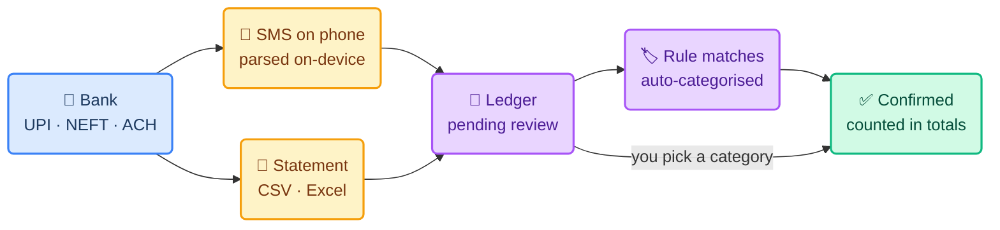

# 📋 Product Requirements

**Paisa — Household Finance Platform**

This document defines the problem Paisa solves, who it is for, the principles it
holds to, and every functional requirement with its current state.

> **Last reviewed** 2026-09-20 · **Status** Phases 1–2 live · **Region** India / INR / Asia-Kolkata

---

## 1. The Problem

An Indian household's money moves through UPI, cards, ACH mandates and bank
transfers, and the only complete record of it is a bank statement nobody reads.
Existing apps either want net-banking credentials, or assume a Western banking
model that has no idea what a VPA is.

> **The bet:** capture is the hard part, not charting. If every payment lands in
> one ledger with the right category and no duplicates, the reports write
> themselves.

---

## 2. Who It Is For

| Persona | Needs | Role in the app |
|---|---|---|
| 👤 **Owner** | One view of household money; corrections without losing history | `book_owner` |
| 👥 **Spouse** | Own private book, plus the shared household book | `book_owner` + `editor` |
| 🧾 **Chartered accountant** | Read and comment at year end; never edit amounts | `reviewer` |
| 🏠 **Second household** | The same app, completely separate data | `book_owner`, own workspace |

---

## 3. Principles

| # | Principle | What it rules out |
|---|---|---|
| P1 | **Never ask for bank credentials** | Account aggregation, scraping, stored PINs |
| P2 | **The bank's figure is a fact** | Silently rewriting an imported amount |
| P3 | **Everything is auditable** | Any change without a before/after record |
| P4 | **Capture beats data entry** | Manual-first workflows |
| P5 | **Households are sealed** | Any cross-tenant read, however convenient |
| P6 | **Not advice** | Recommendations, projections, tax positions |

---

## 4. The Money Journey

How a rupee gets from a bank to a reviewed, categorised ledger entry.

---

## 5. Functional Requirements

Legend — ✅ shipped · 🟡 partial · ⛔ not started

### 5.1 Capture

| ID | Requirement | State |
|---|---|---|
| C1 | Import a bank statement as **CSV**, each row reviewable | ✅ |
| C2 | Import a bank statement as **.xlsx** | ✅ |
| C3 | Import a **PDF** statement, including password-protected files | ⛔ |
| C4 | Detect columns by **header name**, so a new bank works without code | ✅ |
| C5 | Verify amounts against the statement's own **running balance** | ✅ |
| C6 | Never duplicate a row on re-import — per row, not per file | ✅ |
| C7 | Parse financial **SMS on-device**; upload only normalised fields | 🟡 |
| C8 | Upload captured SMS **in the background** | ⛔ |
| C9 | Reconcile an SMS capture against the same payment in a statement | ⛔ |

### 5.2 Ledger

| ID | Requirement | State |
|---|---|---|
| L1 | Integer-paise money; expenses negative, income positive | ✅ |
| L2 | Edit any entry — amount, date, type, merchant, account | ✅ |
| L3 | An imported entry keeps the bank's original figure forever | ✅ |
| L4 | **Void** an entry: it leaves every total, stays in the ledger | ✅ |
| L5 | Split one payment across categories | ✅ |
| L6 | Comment on an entry, visible to everyone with access | ✅ |
| L7 | Page through the full ledger, not just the first 100 | ✅ |
| L8 | Navigate months, not just the current one | ✅ |

### 5.3 Classification

| ID | Requirement | State |
|---|---|---|
| K1 | Confirming with "apply to future" writes a rule | ✅ |
| K2 | Rules match on merchant (exact/contains) or **VPA** | ✅ |
| K3 | Rules only affect future payments, never reviewed history | ✅ |
| K4 | Five groups: Essentials · Income · Lifestyle · Saving · Other | ✅ |
| K5 | Categories are per-workspace and editable | ✅ |

### 5.4 Money Model

| ID | Requirement | State |
|---|---|---|
| M1 | **Spent** = expenses · **Saving** = transfers out · **Balance** = income − spent − saving | ✅ |
| M2 | The category breakdown accounts for every rupee that left | ✅ |
| M3 | Budget as a **% of expected income per group**, not rupees per category | ✅ |
| M4 | Expected income from recurring plans, so budgets work before payday | ✅ |
| M5 | Recurring plans post themselves when due, month-end sticky | ✅ |
| M6 | Show movement **between** your own accounts | ✅ |
| M7 | Refunds counted somewhere | ⛔ |

### 5.5 Access

| ID | Requirement | State |
|---|---|---|
| A1 | Firebase email/password sign-in; no public sign-up | ✅ |
| A2 | Invite someone into an existing book by email | ✅ |
| A3 | A book always keeps one owner; nobody edits their own access | ✅ |
| A4 | A new identity gets its own isolated household | ✅ *(flagged off)* |
| A5 | Disable a user from the dashboard | ⛔ |

---

## 6. Acceptance Criteria That Matter

| Scenario | Expected |
|---|---|
| Re-import the same statement | `imported: 0`, no duplicate rows |
| Import a statement with 172 rows | All 172 stored; the UI pages through them |
| A row's balance doesn't follow | A warning, and the stated amount is still imported |
| Edit an imported amount | Saved, audited, **and** `importedAmount` unchanged |
| A payment to your own account | Typed Transfer → leaves Spent, appears in Saving |
| Sign in with no membership | `403 INVITE_REQUIRED`, and the log says why |
| Another household's book id | `404` — not `403`, so it cannot be enumerated |

---

## 7. Out of Scope

Tax calculation or filing · investment or financial advice · moving money ·
bank API integration · multi-currency · a public marketplace.

---

## 8. How We Know It Works

| Measure | Target | Today |
|---|---|---|
| Statement rows parsed correctly | 100%, proven by balance checksum | ✅ 0 warnings — SBI 17, HDFC 172 |
| Payments needing manual categorisation | Falls monthly as rules accumulate | 24 rules live |
| Duplicate entries in the ledger | Zero | ✅ Zero |
| Time from payment to ledger | Under a minute | ⛔ blocked on background upload |
