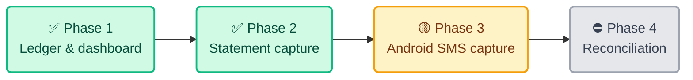

# ✅ Tasks & Progress

**Paisa — Household Finance Platform**

This document tracks what is shipped, what is next, and who owns each step.

> **Last reviewed** 2026-09-20 · `TODO.md` at the repo root is the working
> checklist — if the two disagree, **`TODO.md` wins**

---

## 1. Where We Are



| Phase | Scope | State |
|---|---|---|
| **1 — Ledger & dashboard** | Books, roles, transactions, categories, rules, audit | ✅ Live |
| **2 — Statement capture** | CSV + Excel import, budgets, accounts | ✅ Live |
| **3 — Private capture** | Android SMS capture, background upload, push | 🟡 Written, not shipped |
| **4 — Reconciliation** | Match SMS against statements, flag look-alikes | ⛔ Not started |

```text
Phase 1  ██████████████████████████████  100%
Phase 2  ██████████████████████████░░░░   85%   PDF import outstanding
Phase 3  ████████░░░░░░░░░░░░░░░░░░░░░░   25%   code exists, never run in prod
Phase 4  ░░░░░░░░░░░░░░░░░░░░░░░░░░░░░░    0%
```

> **Health** — 57 tests passing · lint clean · typecheck clean · 5 migrations applied · 0 npm advisories

---

## 2. Done

| Area | Shipped |
|---|---|
| 📒 **Ledger** | Full edit of any entry · void · split · comments · pagination beyond 100 · month navigation |
| 📄 **Import** | CSV and `.xlsx` on one pipeline · SBI and HDFC narrations · balance checksum · per-row dedupe · 2,000-row cap |
| 💰 **Money model** | Spent / Saving / Balance · breakdown covering uncategorized, splits and transfers · account-to-account flows |
| 🎯 **Budgets** | Percentage of expected income per group · 50/30/20 preset · expected income from recurring plans |
| 🔁 **Recurring** | Self-posting when due · month-end sticky · catch-up after downtime · idempotent |
| 🏠 **Tenancy** | Isolated workspaces · invitations · self-provisioning (flagged off) |
| 🔒 **Security** | Full-codebase audit; all High and Medium findings fixed |
| 🚀 **Ops** | One-command deploy · backed-up migrations · scoped ledger reset |
| 🌐 **Public** | 13 information pages at `/about-us`, `/help`, … |

---

## 3. Next — Android on a Real Phone

Nothing below is verifiable until real SMS from real banks is flowing.

| # | Task | Owner | Blocks |
|---|---|---|---|
| 1 | Register the Android app in Firebase; add `google-services.json` | 👤 **Arjun** | Everything — the app cannot authenticate |
| 2 | Replace hardcoded `bookId` + dev-auth header with real book selection and an ID token | 🤖 Claude | Every upload 404s today |
| 3 | Point the build at production via `--dart-define` | 🤖 Claude | — |
| 4 | Collect 10–20 real bank SMS, redacted | 👤 **Arjun** | The parser has 3 invented fixtures |
| 5 | Background upload — WorkManager + `BOOT_COMPLETED` | 🤖 Claude | The "under a minute" goal |
| 6 | Play Store restricted-permission declaration | 👤 **Arjun** | Weeks of lead time — start now, in parallel |
| 7 | Consolidate the duplicated Kotlin/Dart parsers | 🤖 Claude | They will drift |

> ⚠️ `google-services.json` and `firebase_options.dart` are both **missing**.
> **Task 1 is the gate on the entire phase.**

---

## 4. Then — Close the Capture Loop

| Task | Note |
|---|---|
| Push notification on `pending_review` | The worker's handler is a stub and no Redis runs. The API's own `setInterval` is probably the right home |
| Reconcile SMS against statement imports | `externalRef` holds the UPI reference on both — the natural key |
| Flag look-alike duplicates | Same merchant, amount and day. **Flag, never merge** |

---

## 5. Smaller, Worth Doing

| Task | Why it matters |
|---|---|
| **Speed up deploys** | `npm ci` rebuilds `node_modules` twice every deploy. Plan: stamp the lockfile hash, skip when unchanged |
| **PDF import** | Blocked on one real sample — row detection is shaped entirely by a bank's layout |
| **Refunds are invisible** | `kind: 'refund'` appears in no tile. Decide the definition first |
| **Drop per-category budgets** | Superseded by the group plan; endpoints still exist unread |
| `GET /transactions/:id` | Reading one entry means listing and filtering client-side |
| Recurring "last working day" | Month-end is sticky and correct, but holidays need a calendar |

---

## 6. Before Enabling `TENANT_SELF_PROVISION`

| # | Task | Owner |
|---|---|---|
| 1 | **Disable public sign-up in Firebase** — Auth → Settings → User actions | 👤 **Arjun** |
| 2 | Let a household rename its books | 🤖 Claude |
| 3 | A way to disable a user from the dashboard | 🤖 Claude |

> Without step 1, the web API key is enough for anyone to register themselves a
> household. **That setting is the only real control.**

---

## 7. Security Backlog

All High and Medium findings from the 2026-09-09 audit are fixed. These remain:

| Finding | Severity |
|---|---|
| 403s name the role (`Role viewer cannot edit`) | 🟢 Low |
| Emails written to the journal during provisioning | 🟢 Low |
| No way to disable a user | 🟢 Low |
| Nothing prunes expired `IdempotencyRecord` / `Attachment` rows | 🟢 Low |
| Self-provisioning rate-limited only by the global 120/min per IP | 🟢 Low |
| CSP carries `script-src 'unsafe-inline'` — vinext emits ~16 nonce-less inline scripts | 🟢 Low, accepted |

---

## 8. Known Data Quirks in the Live Books

| Book | Quirk |
|---|---|
| `book_owner` | `BOAZ M R +₹5,000` is typed `transfer`, so it is excluded from Income. Retype if it was a repayment |
| `book_owner` | The ₹1,04,178 Salary was entered by hand; no matching credit is in the statement window. Void it once capture runs |
| Jadheer's book | 172 HDFC rows, all August. Use **‹** to reach them — the dashboard opens on the current month |
